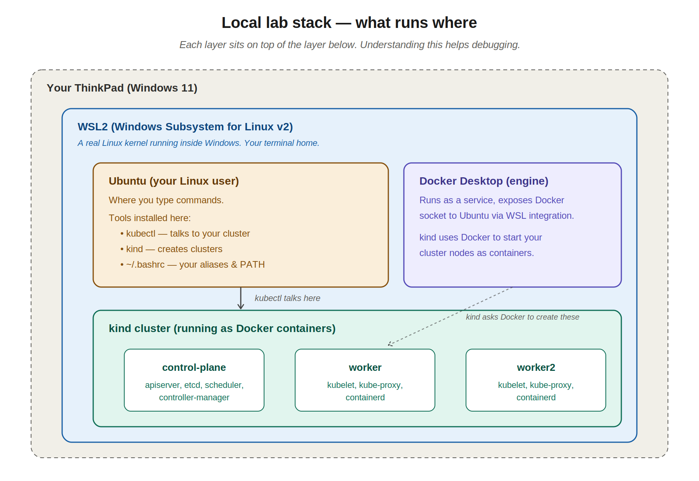
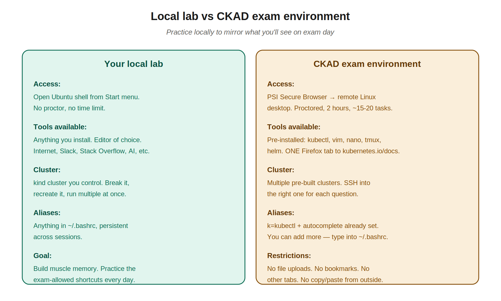
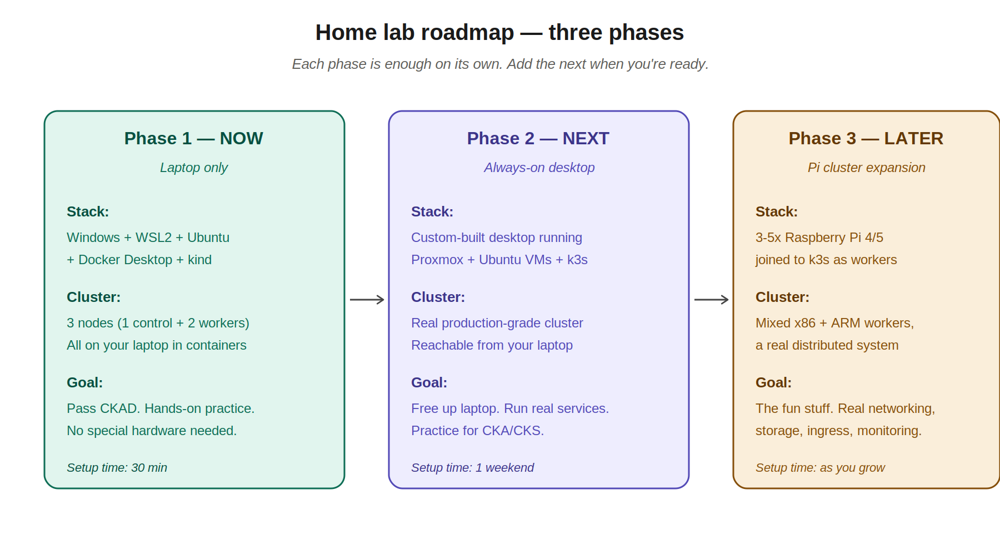

# Local Lab Setup

> This document captures everything about my CKAD lab setup — what's installed, why, how to recreate it, useful commands, and how it relates to the actual exam environment. If anything ever breaks or I get a new machine, this is the playbook.

---

## 1. Why have a local lab at all?

Watching videos doesn't pass CKAD. The exam is **performance-based** — 15-20 hands-on tasks in 2 hours, typing real `kubectl` commands and writing real YAML on a remote Linux desktop. People who only watch and don't practice fail. The local lab gives me a real Kubernetes cluster to break and rebuild as I learn.

**Specific to my situation:** I can't take the actual exam on my JPMC laptop (Linux Foundation rules — no employer machines unless you have admin). My personal ThinkPad is the right call long-term too, since it'll host the lab without IT restrictions.

---

## 2. The full stack — what runs where



Reading top to bottom:

- **Windows 11** — the OS on my ThinkPad
- **WSL2** (Windows Subsystem for Linux v2) — a real Linux kernel running inside Windows, no dual-boot needed
- **Ubuntu** — my Linux distro inside WSL2, where I open a terminal and run commands
- **Docker Desktop** — runs on Windows, exposes a Docker socket to Ubuntu via WSL integration
- **kind** (Kubernetes IN Docker) — creates a Kubernetes cluster as a set of Docker containers
- **The cluster itself** — 1 control plane + 2 worker nodes, each running as a Docker container on my laptop

The whole stack is one command (`kind create cluster`) away, and one command (`kind delete cluster`) away from being gone. That tearable-down property is what makes it ideal for learning.

---

## 3. Initial setup (already done — recorded for next time)

These are the steps I followed once. Recorded here so I can rebuild from a fresh laptop if needed.

### 3.1 Install WSL2 with Ubuntu

In **PowerShell as Administrator**:

```powershell
wsl --install
```

After reboot, an Ubuntu terminal opens and prompts for a Linux username and password. **Write these down** — they're separate from the Windows login.

Verify:
```powershell
wsl --list --verbose
# Should show: Ubuntu, Running, VERSION 2
```

If somehow VERSION shows as 1: `wsl --set-default-version 2` and reinstall Ubuntu.

### 3.2 Install Docker Desktop

Download from https://www.docker.com/products/docker-desktop/

During install, ensure "Use WSL 2 instead of Hyper-V" is checked.

After install: Docker Desktop → **Settings** → **Resources** → **WSL Integration** → enable Ubuntu → **Apply & Restart**.

Verify from inside the Ubuntu shell:
```bash
docker ps
# Should show column headers, no errors
```

### 3.3 Install kubectl in Ubuntu

```bash
curl -LO "https://dl.k8s.io/release/$(curl -L -s https://dl.k8s.io/release/stable.txt)/bin/linux/amd64/kubectl"
sudo install -o root -g root -m 0755 kubectl /usr/local/bin/kubectl
rm kubectl
kubectl version --client
```

Reference: https://kubernetes.io/docs/tasks/tools/install-kubectl-linux/

### 3.4 Install kind in Ubuntu

```bash
curl -Lo ./kind https://kind.sigs.k8s.io/dl/v0.27.0/kind-linux-amd64
chmod +x ./kind
sudo mv ./kind /usr/local/bin/kind
kind version
```

Reference: https://kind.sigs.k8s.io/docs/user/quick-start/

### 3.5 Create the multi-node cluster

```bash
mkdir -p ~/k8s-lab && cd ~/k8s-lab

cat > kind-config.yaml <<EOF
kind: Cluster
apiVersion: kind.x-k8s.io/v1alpha4
nodes:
- role: control-plane
- role: worker
- role: worker
EOF

kind create cluster --name ckad-lab --config kind-config.yaml
```

Verify:
```bash
kubectl get nodes
# 3 nodes — 1 control-plane, 2 workers, all Ready
```

### 3.6 Smoke test — create your first pod

Nodes being `Ready` only proves the API is up. To prove pods can actually be scheduled and pulled, create one:

```bash
# Imperative — fastest possible "is this thing working"
kubectl run smoketest --image=nginx

# Watch it come up
kubectl get pods -w
# NAME        READY   STATUS              RESTARTS   AGE
# smoketest   0/1     ContainerCreating   0          2s
# smoketest   1/1     Running             0          11s
# Ctrl-C once it's Running

# Confirm it landed on a worker node, not the control plane
kubectl get pod smoketest -o wide
# NAME        ...   NODE                       ...
# smoketest   ...   ckad-lab-worker            ...
```

If the pod reaches `Running`, the whole stack works: kubelet on the worker is healthy, the container runtime can pull from Docker Hub, networking inside the cluster is up. This is the smoke test that future "did I break my cluster?" sessions should always start with.

Tear it down before moving on:

```bash
kubectl delete pod smoketest
```

If it's stuck in `ImagePullBackOff`, your worker node can't reach Docker Hub — check Docker Desktop is running and the WSL integration toggle is on. If it's stuck in `Pending`, run `kubectl describe pod smoketest` and read the **Events** at the bottom; usually it's "no nodes have free resources" (close other apps) or a taint issue.

---

## 4. Aliases and shell configuration

This is the most important section for daily use. The exam pre-configures `k=kubectl` and autocomplete, so practicing with the same setup builds the right muscle memory.

### 4.1 What's in my ~/.bashrc

```bash
# kubectl autocomplete + alias
source <(kubectl completion bash)
alias k=kubectl
complete -o default -F __start_kubectl k

# The "dry-run" shortcut — generates YAML without applying
export do="--dry-run=client -o yaml"

# Force-delete shortcut — for when pods hang on delete
export now="--force --grace-period=0"
```

Apply changes without restarting the shell:
```bash
source ~/.bashrc
```

### 4.2 What each piece does

| Snippet | What it gives me |
|---|---|
| `source <(kubectl completion bash)` | Tab completion for `kubectl` (resources, names, flags) |
| `alias k=kubectl` | Type `k` instead of `kubectl` — saves seconds, adds up over hours |
| `complete -o default -F __start_kubectl k` | Tab completion works on `k` too, not just `kubectl` |
| `export do="--dry-run=client -o yaml"` | Use as `k run nginx --image=nginx $do > pod.yaml` to generate YAML fast |
| `export now="--force --grace-period=0"` | Use as `k delete pod stuck-pod $now` to nuke a hung pod |

### 4.3 Examples in practice

```bash
# Generate a pod YAML without creating the pod
k run nginx --image=nginx $do > pod.yaml

# Generate a deployment YAML
k create deployment web --image=nginx --replicas=3 $do > deploy.yaml

# Delete a pod that won't go away
k delete pod stuck-pod $now
```

These shortcuts save 10-20 minutes total on a 2-hour exam. Not earth-shattering on their own, but combined with autocomplete they're the difference between finishing and not.

---

## 5. The exam environment — what to expect



### What the exam actually looks like

- **Delivered through the PSI Secure Browser** — a custom browser I install at exam time, takes over my screen
- **Presents a remote Linux desktop** — full Ubuntu environment with terminal, Firefox, vim/nano, all the standard tools
- **2 hours, 15-20 tasks** — each task usually requires SSHing into a specific cluster (different clusters for different questions)
- **One Firefox tab allowed** — only to https://kubernetes.io/docs/. No bookmarks, no other tabs, no Stack Overflow, no AI assistants
- **Proctored remotely** — webcam on, mic on, screen shared. Need a clean room with nobody else and no notes visible

### What's pre-configured in the exam

- `kubectl` is already installed on every cluster
- `k=kubectl` alias is **already set** when the exam starts
- kubectl bash autocompletion is **already enabled**
- `vim`, `nano`, `tmux`, `helm` are pre-installed

### What I have to do at the start of the exam

If I want extra aliases (like `$do` and `$now` above), I have to type them into `~/.bashrc` manually:

```bash
# At exam start, paste this into the terminal:
echo 'export do="--dry-run=client -o yaml"' >> ~/.bashrc
echo 'export now="--force --grace-period=0"' >> ~/.bashrc
source ~/.bashrc
```

Takes about 30 seconds. Worth it if I've practiced with these locally.

### What I CANNOT do

- Upload a file with my aliases pre-loaded
- Bring browser bookmarks
- Use my own laptop's customizations (different machine, fresh environment)
- Open multiple Firefox tabs
- Reference notes outside the exam window
- Have anything else open on my desktop

**Implication:** muscle memory is everything. Anything I have to look up costs time. Practice the same way every day so the keystrokes are automatic.

### Useful exam resources (allowed)

The official "Resources Allowed" page lists exactly what's permitted:
https://docs.linuxfoundation.org/tc-docs/certification/certification-resources-allowed

Key allowed sites for CKAD:
- https://kubernetes.io/docs/
- https://kubernetes.io/blog/
- https://github.com/kubernetes/

Practice navigating kubernetes.io/docs *before* the exam. Specifically know where to find:
- Pod YAML examples
- Deployment YAML examples
- Service types
- ConfigMap and Secret usage
- Probes documentation

---

## 6. Daily lab workflow

### Starting work

Open Ubuntu shell from Start menu. Then:

```bash
# Confirm the cluster is up (it persists across reboots, but Docker may need restarting)
k get nodes

# If "kubectl: connection refused" or no nodes, restart Docker Desktop, then:
kind get clusters         # see what's there
# If ckad-lab is missing, recreate from the config file
kind create cluster --name ckad-lab --config ~/k8s-lab/kind-config.yaml
```

### Working through a chapter

```bash
cd ~/k8s-lab

# Create a directory per chapter to stay organized
mkdir ch04-yaml && cd ch04-yaml

# Generate starter YAML
k run nginx --image=nginx $do > pod.yaml

# Edit
vim pod.yaml          # or: code pod.yaml (opens VS Code on Windows)

# Apply and check
k apply -f pod.yaml
k get pods
k describe pod nginx
```

### Resetting between experiments

```bash
# Wipe everything in the default namespace
k delete all --all

# Or nuke the whole cluster and start fresh — takes about 60 seconds
kind delete cluster --name ckad-lab
kind create cluster --name ckad-lab --config ~/k8s-lab/kind-config.yaml
```

### Multiple clusters at once

For experimenting without breaking the main lab:

```bash
kind create cluster --name experiment

# Switch between clusters
kubectl config get-contexts
kubectl config use-context kind-ckad-lab
kubectl config use-context kind-experiment
```

---

## 7. Vim — the survival kit

Vim is on every Linux system that ships with a base install: the CKAD exam environment, every container you'll `kubectl exec` into, kind nodes, JPMC servers, and the Ubuntu shell. Nano is friendlier but it's not always there. Learn enough vim to not be blocked.

You'll also stop being mystified by:
- The screen that appears when you run `git commit` without `-m`
- "I SSH'd into the box and now I can't get out of this editor"
- The exam, where you'll be editing YAML in vim for two straight hours

### 7.1 The two-mode concept (this is the whole trick)

Vim has two modes that matter:

| Mode | What you can do | How to enter |
|---|---|---|
| **Normal mode** | Run commands (delete, copy, save, move) | Press `Esc` |
| **Insert mode** | Actually type text into the file | Press `i` from Normal mode |

Vim starts in Normal mode. New users get stuck because they expect to type immediately and the keystrokes do weird things — that's because each letter is a command in Normal mode. Press `i` first, type your text, then `Esc` to come back out.

If you ever feel lost, mash `Esc` a few times. You'll be in Normal mode and safe.

### 7.2 The 15 commands that get you through CKAD

```
Getting in and out
  vim filename       open a file (creates it if it doesn't exist)
  i                  switch to Insert mode (now you can type)
  Esc                back to Normal mode
  :w                 save (write)
  :q                 quit
  :wq                save and quit
  :q!                quit without saving (discard changes)

Moving around (Normal mode)
  arrow keys         up/down/left/right
  gg                 jump to first line of file
  G                  jump to last line
  :42                jump to line 42
  /word<Enter>       search forward for "word" (n for next match)

Editing (Normal mode)
  dd                 delete (cut) the current line
  yy                 yank (copy) the current line
  p                  paste below cursor
  u                  undo
  Ctrl+r             redo
```

That's enough. You don't need visual mode, macros, or marks for the exam.

### 7.3 Critical vim config for YAML

YAML's spaces-not-tabs rule will burn you if vim auto-inserts a tab. Configure `~/.vimrc` so vim does the right thing automatically:

```vim
set expandtab          " Tab key inserts spaces, not a tab character
set tabstop=2          " A tab is shown as 2 spaces wide
set shiftwidth=2       " Auto-indent uses 2 spaces
set number             " Show line numbers (helpful when errors say "line 42")
```

Apply by editing `~/.vimrc` once and pasting these in.

### 7.4 The one-line exam-start setup

You can't bring a `~/.vimrc` into the exam — every cluster is a fresh shell. Set it up in one line at the start:

```bash
echo "set expandtab tabstop=2 shiftwidth=2 number" > ~/.vimrc
```

Type this once at the start of the exam, alongside the `$do` and `$now` aliases. Takes 5 seconds and saves a lot of indentation grief later.

### 7.5 Unblocking the git commit screen

If you forget the `-m` flag on `git commit`, vim opens with the commit message template:

```
1. Press i              # enter Insert mode
2. Type your message    # at the top, above the # comments
3. Press Esc            # back to Normal mode
4. Type :wq             # save and quit — commit goes through
```

If you want to abort the commit instead: `:q!` (quit without saving) — git sees an empty message and cancels the commit.

### 7.6 Going deeper if you want to

Run `vimtutor` from any Linux shell — it's a built-in interactive tutorial, takes about 30 minutes, and covers everything above plus a bit more. Worth doing once before exam day.

---

## 8. Editor — VS Code with WSL extension

VS Code on Windows + the **WSL extension** lets me edit Linux files with full IDE features.

Install the WSL extension once: Extensions panel → search "WSL" → install the Microsoft one.

From the Ubuntu shell:

```bash
cd ~/k8s-lab/ch04-yaml
code .
```

VS Code opens, editing the WSL filesystem. Useful additional extensions:
- **Kubernetes** by Microsoft — YAML schema validation for pod/deployment manifests
- **YAML** by Red Hat — general YAML linting (catches indentation issues)

---

## 9. Future-proofing — the home lab roadmap



### Phase 1 — current state

Everything described above. ThinkPad with WSL2 + Docker + kind. Sufficient for CKAD. **No need to advance until I've passed the exam.**

### Phase 2 — when I build the desktop

Move the cluster off the laptop:

- Build a desktop with 32-64GB RAM
- Install **Proxmox VE** (free hypervisor) on bare metal
- Create 3 Ubuntu VMs (1 master + 2 workers)
- Install **k3s** (lightweight production Kubernetes from Rancher) across them
- Reach the cluster from my laptop via `kubectl` config pointing at the desktop's IP

This frees up the laptop for actual work and study, gives me an always-on cluster I can run real services on, and starts looking like a CKA-relevant environment.

### Phase 3 — Pi cluster

Add 3-5 Raspberry Pi 4s or 5s as additional k3s workers:

- Stack them in a case with PoE switch and shared power
- Mix x86 (desktop) and ARM (Pis) workers in the same cluster
- Practice things CKAD doesn't even cover: ingress controllers, MetalLB for LoadBalancer services, Longhorn for distributed storage, Prometheus + Grafana for monitoring

This is the "real home lab" stage. Useful for CKS and just for fun.

---

## 10. Quick reference — most useful commands

```bash
# Cluster lifecycle
kind create cluster --name <name> --config <file>
kind delete cluster --name <name>
kind get clusters

# Context switching
kubectl config get-contexts
kubectl config use-context kind-<name>
kubectl config set-context --current --namespace=<ns>

# Pod basics
k get pods
k get pods -o wide
k describe pod <name>
k logs <name> -f
k exec -it <name> -- bash

# YAML generation (the big time-savers)
k run nginx --image=nginx $do > pod.yaml
k create deployment web --image=nginx --replicas=3 $do > deploy.yaml
k expose deployment web --port=80 $do > svc.yaml

# Validation before apply
k apply -f file.yaml --dry-run=client
k apply -f file.yaml --dry-run=server

# Force-delete a stuck resource
k delete pod <name> $now
```

---

## 11. Troubleshooting — when things break

### `kubectl: connection refused`

Docker Desktop isn't running, or kind cluster is gone.

```bash
# Make sure Docker is up
docker ps

# Make sure cluster is up
kind get clusters

# Recreate if needed
kind create cluster --name ckad-lab --config ~/k8s-lab/kind-config.yaml
```

### `command not found: kubectl` (or `kind`)

PATH issue. Verify:
```bash
which kubectl
which kind
```

If empty, the binary's not in `/usr/local/bin/` — re-run the install steps in section 3.

### Docker integration broken after Windows restart

Docker Desktop → Settings → Resources → WSL Integration → toggle Ubuntu off and back on → Apply & Restart.

### Cluster suddenly slow

Probably running out of laptop resources. Check Task Manager. If RAM is pegged, close other apps or restart Docker Desktop.

### "namespace not found" errors

Wrong context, or a namespace got deleted. Check:
```bash
kubectl config current-context
kubectl get namespaces
```

---

## 12. Useful links bookmarked

- **Kubernetes docs** (the only thing allowed on the exam): https://kubernetes.io/docs/
- **kind quickstart**: https://kind.sigs.k8s.io/docs/user/quick-start/
- **Linux Foundation CKAD page**: https://training.linuxfoundation.org/certification/certified-kubernetes-application-developer-ckad/
- **CKAD curriculum** (what's actually on the exam): https://github.com/cncf/curriculum
- **Resources Allowed** (official): https://docs.linuxfoundation.org/tc-docs/certification/certification-resources-allowed
- **Important Instructions for CKAD** (official): https://docs.linuxfoundation.org/tc-docs/certification/tips-cka-and-ckad
- **killer.sh** (exam simulator, included with exam fee): https://killer.sh/

---

## 13. Pre-exam checklist

A week before the exam:
- [ ] Run the PSI System Check (link comes with registration)
- [ ] Test the personal laptop, not the JPMC one
- [ ] Make sure I have a quiet room with no clutter visible
- [ ] Webcam works, microphone works
- [ ] Single monitor only — disconnect any external displays
- [ ] Government-issued photo ID ready
- [ ] killer.sh simulator done at least once (preferably twice)

Day of:
- [ ] Close everything except PSI Secure Browser before launch
- [ ] No corporate VPN — disable
- [ ] Have water nearby (proctor allows clear bottle)
