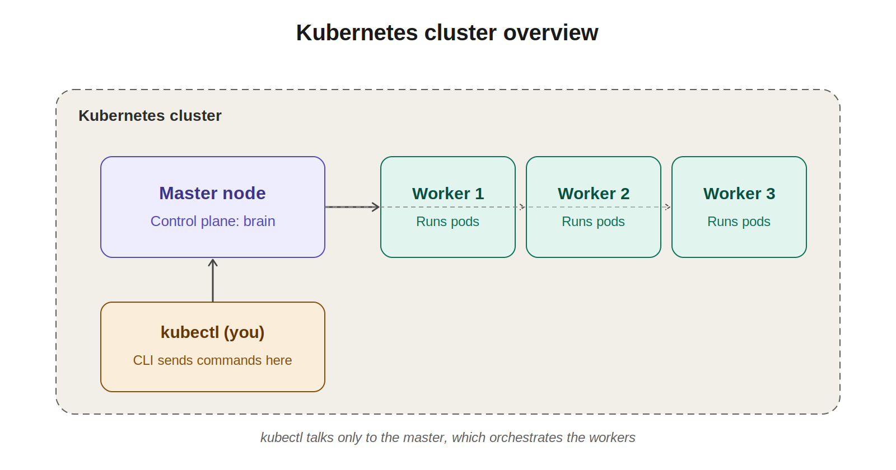
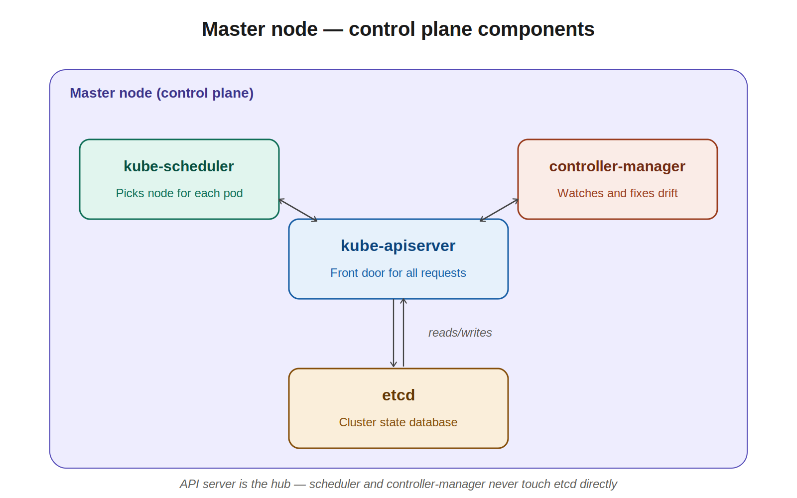
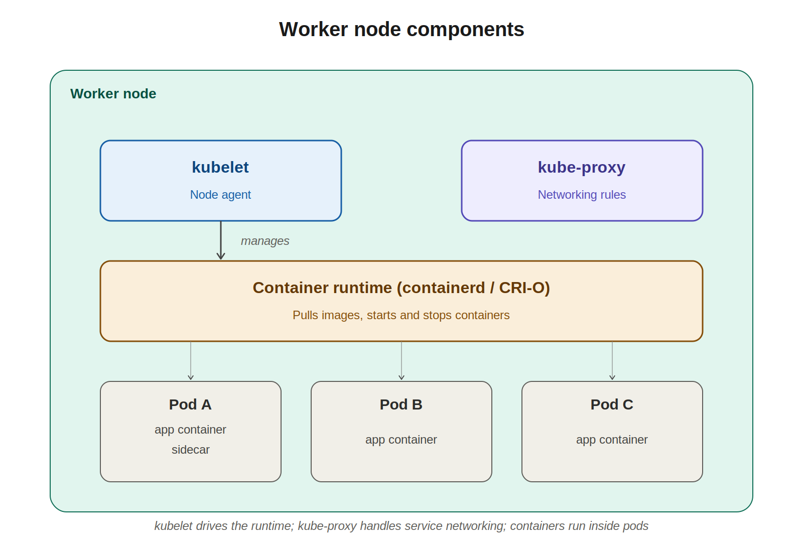
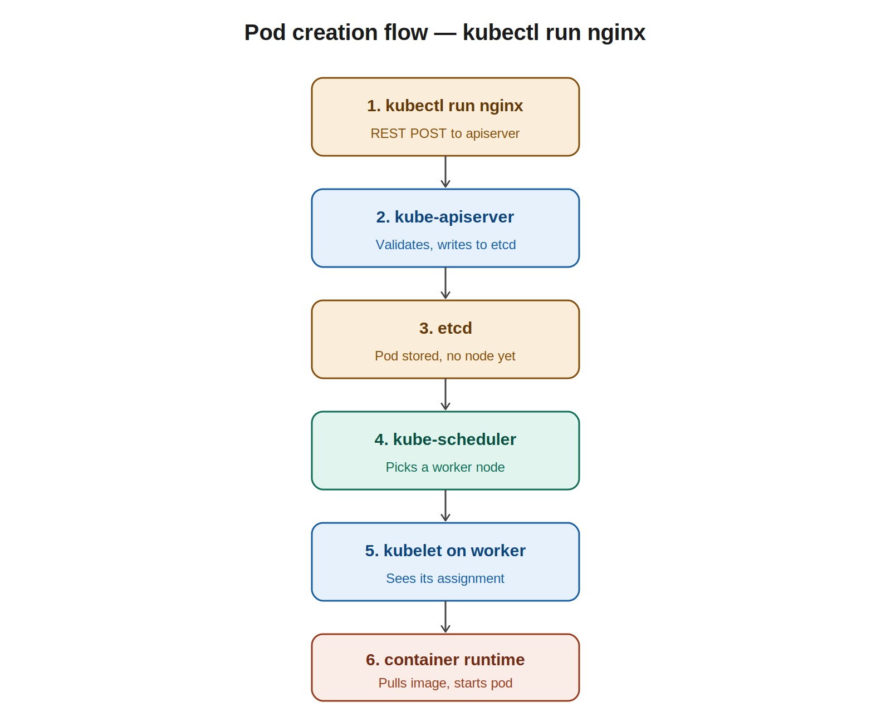

# 01 — Kubernetes Architecture

> **CKAD prep notes.** Architecture chapter: cluster basics, master vs worker, components, kubectl.
> Keep adding to this folder as new topics come up (pods, deployments, services, configmaps, etc.).

---

## 1. The big picture: cluster, nodes, master vs worker

A **Kubernetes cluster** is a group of machines (physical or VMs) working together to run containers. Each machine in the cluster is a **node**. Two roles:

- **Master node** (also called the **control plane node**) — the brain. Decides *what* runs *where*. Doesn't run application pods in typical production setups.
- **Worker node** — the muscle. Runs application pods.

`kubectl` always talks to the master. The master orchestrates the workers. You never `kubectl` directly into a worker — requests flow through the master, which dispatches the work.



---

## 2. What gets installed when you "install Kubernetes"

Kubernetes is not one program. It's a **collection of components**, split between master and worker nodes by role.

| Component | Lives on | Job |
|---|---|---|
| **kube-apiserver** | Master | Front door. Every request (kubectl, other components, workers) goes through it. |
| **etcd** | Master | Database. Stores entire cluster state as key-value pairs. |
| **kube-scheduler** | Master | Decides which worker node a new pod runs on. |
| **kube-controller-manager** | Master | Background loops that watch state and fix drift. |
| **kubelet** | Worker (and master) | Node agent. Talks to apiserver, tells container runtime to start/stop containers. |
| **kube-proxy** | Worker | Networking rules so pods can reach services. |
| **Container runtime** | Worker (and master) | Actually runs containers — containerd, CRI-O. |

---

## 3. Master node setup (control plane)

Four components live on the master. The **API server is the hub** — every other component talks through it. The scheduler and controller-manager **never read or write etcd directly**; they go through the API server.



### kube-apiserver

- Single entry point to the cluster. All other components, including kubectl, communicate with it exclusively.
- Validates and processes REST requests (Kubernetes API is REST over HTTPS).
- Reads from and writes to etcd. **Nothing else writes to etcd directly.**
- Authenticates and authorizes every request.
- Mental model: every change in the cluster = a write to the API server, which then writes to etcd.

### etcd

- Distributed key-value store. Stores the entire cluster state: every pod, deployment, secret, configmap, node, namespace, everything.
- Backup etcd = backup your cluster's state.
- In production: cluster of 3 or 5 nodes for HA (Raft consensus).
- Default ports: **2379** (client), **2380** (peer).

### kube-scheduler

- Watches for newly created pods that don't yet have a node assigned (`spec.nodeName` is empty).
- Picks the best node based on resource requirements, node affinity, taints/tolerations, etc.
- **Does not start the pod.** It just writes the assignment ("pod X → node Y") back through the API server. The kubelet on that node takes over.

### kube-controller-manager

- A single binary running many controller loops. Each watches a specific resource type and reconciles desired vs actual state.
- Notable controllers inside it:
  - **Node controller** — notices when nodes go down.
  - **Replication controller** — ensures the right number of pod replicas exist.
  - **Deployment controller** — manages rollouts and rollbacks.
  - **Endpoints controller** — connects services to pods.
  - **Service account & token controller** — creates default accounts and API tokens for new namespaces.

---

## 4. Worker node setup

Three components run on every worker.



### kubelet

- Agent that runs on every node (master included, in many setups).
- Continuously talks to the API server: "anything new for me?"
- When the scheduler assigns a pod to its node, the kubelet sees it on its watch, then instructs the container runtime to pull the image and start the containers.
- Reports node and pod status back to the API server (this is what shows up in `kubectl get pods`).
- Runs **liveness and readiness probes**.

### kube-proxy

- Maintains network rules on the node so traffic destined for a Kubernetes Service gets routed to one of the backing pods.
- Implemented with iptables, IPVS, or eBPF rules on the host.
- This is what makes Service abstractions actually work — when you hit a service IP, kube-proxy's rules forward you to a real pod.

### Container runtime

- The actual software that runs containers. Talks to kubelet via the **Container Runtime Interface (CRI)**.
- Modern options: **containerd**, **CRI-O**.
- Docker is no longer used directly since Kubernetes 1.24.
- Pulls images from registries, starts containers, manages their lifecycle.

---

## 5. End-to-end: what happens when you run `kubectl run nginx`

This ties everything together.



1. **kubectl run nginx** — kubectl sends a REST POST to the API server.
2. **kube-apiserver** validates the request and writes the pod object to etcd.
3. **etcd** stores the pod (no node assigned yet).
4. **kube-scheduler** sees an unscheduled pod, picks a worker node, updates the pod's `nodeName` via the API server.
5. **kubelet** on that node was watching the API server, sees the new assignment, picks up the work.
6. **Container runtime** pulls the image and starts the container(s).

> **Key pattern:** components **watch the API server** rather than calling each other directly. The scheduler doesn't *call* the kubelet — it updates a field, and the kubelet sees the update on its watch. This is how Kubernetes achieves loose coupling.

---

## 6. kubectl notes

### What kubectl actually is

A CLI that builds REST requests, sends them to the API server, and pretty-prints the response. Anything kubectl does, you could do with curl — but you wouldn't want to. Configuration lives in `~/.kube/config` (the kubeconfig file): which cluster, which user/credentials, which namespace.

### Command anatomy

```
kubectl <verb> <resource> [name] [flags]
```

Examples:
```bash
kubectl get pods
kubectl describe pod nginx
kubectl delete deployment my-app
kubectl logs my-pod -c my-container
```

### Most-used commands for CKAD

```bash
# Inspect
kubectl get pods                        # list pods in current namespace
kubectl get pods -A                     # all namespaces
kubectl get pods -o wide                # extra columns (node, IP)
kubectl get pods -o yaml                # full spec as YAML
kubectl describe pod <name>             # detailed status, events, recent failures

# Stuff I already do at work
kubectl logs <pod>                      # logs from a pod
kubectl logs <pod> -c <container>       # multi-container pod, pick one
kubectl logs <pod> -f                   # follow (tail -f)
kubectl logs <pod> --previous           # logs from a crashed previous container
kubectl exec -it <pod> -- bash          # shell into container
kubectl exec <pod> -- <command>         # one-off command

# Create / change
kubectl apply -f manifest.yaml          # idempotent create or update — preferred
kubectl create -f manifest.yaml         # create only, fails if exists
kubectl delete -f manifest.yaml
kubectl edit deployment <name>          # opens YAML in editor; saves apply changes
kubectl scale deployment <name> --replicas=5
kubectl rollout status deployment/<name>
kubectl rollout undo deployment/<name>

# Context & namespace
kubectl config current-context
kubectl config use-context <ctx>
kubectl config set-context --current --namespace=<ns>

# Imperative shortcuts (huge time-savers on the exam)
kubectl run nginx --image=nginx                          # quick pod
kubectl create deployment web --image=nginx --replicas=3
kubectl expose deployment web --port=80 --type=ClusterIP

# Generate YAML without applying — exam gold
kubectl run nginx --image=nginx --dry-run=client -o yaml > pod.yaml
kubectl create deployment web --image=nginx --dry-run=client -o yaml > deploy.yaml
```

### Three things that will save me on the exam

1. **`--dry-run=client -o yaml`** — generate a starting YAML, then edit. Faster than writing from scratch.
2. **`kubectl explain pod.spec.containers`** — built-in docs for any field; tab through the schema without leaving the terminal.
3. **Set up `alias k=kubectl`** and kubectl autocompletion. The exam is timed.

### Mapping back to what I already do

When I run `kubectl exec -it my-pod -- bash` at work, the full chain is:

1. kubectl reads `~/.kube/config`
2. Sends an exec request to the **API server**
3. API server checks auth, forwards the request to the **kubelet** on the node where my-pod runs
4. Kubelet asks the **container runtime** to attach a shell session
5. Traffic streams back through the same path to my terminal

Same chain for `kubectl logs`, except the kubelet is reading the container's stdout/stderr stream from the runtime instead of attaching a TTY.

---

## Quick recall checklist

Use this as a self-quiz before moving to the next chapter:

- [ ] Name the four control plane components and what each does
- [ ] Name the three worker node components and what each does
- [ ] Which component is the only one that writes to etcd?
- [ ] What does the scheduler actually do when it "schedules" a pod?
- [ ] How does the kubelet know to start a pod?
- [ ] What does kube-proxy do, and how is it implemented under the hood?
- [ ] What's the difference between `kubectl create` and `kubectl apply`?
- [ ] What does `--dry-run=client -o yaml` do, and why is it useful on the exam?

---

## Notes for next chapters

Topics to cover next:
- Pods (single vs multi-container, init containers, sidecars)
- Deployments, ReplicaSets, rolling updates
- Services (ClusterIP, NodePort, LoadBalancer, Ingress)
- ConfigMaps and Secrets
- Volumes and persistent storage
- Namespaces and resource quotas
- Liveness, readiness, startup probes
- Jobs and CronJobs
