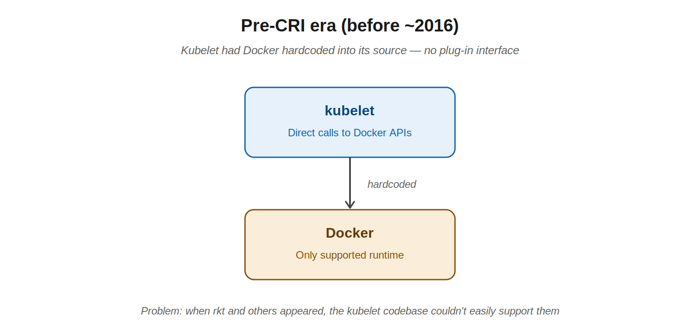
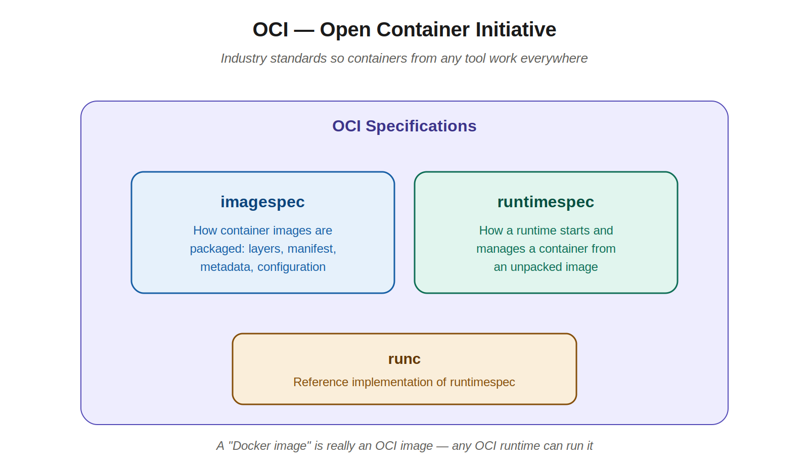
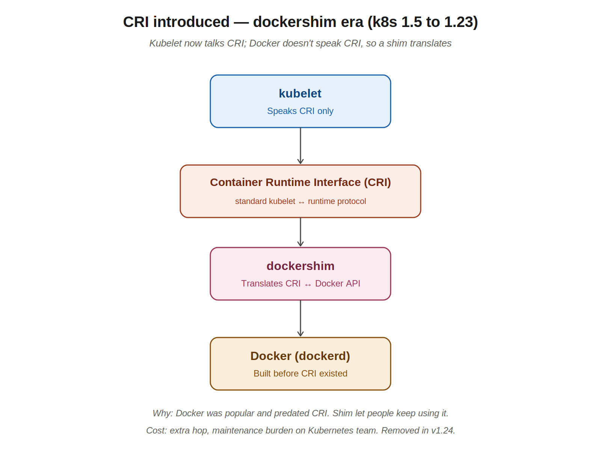
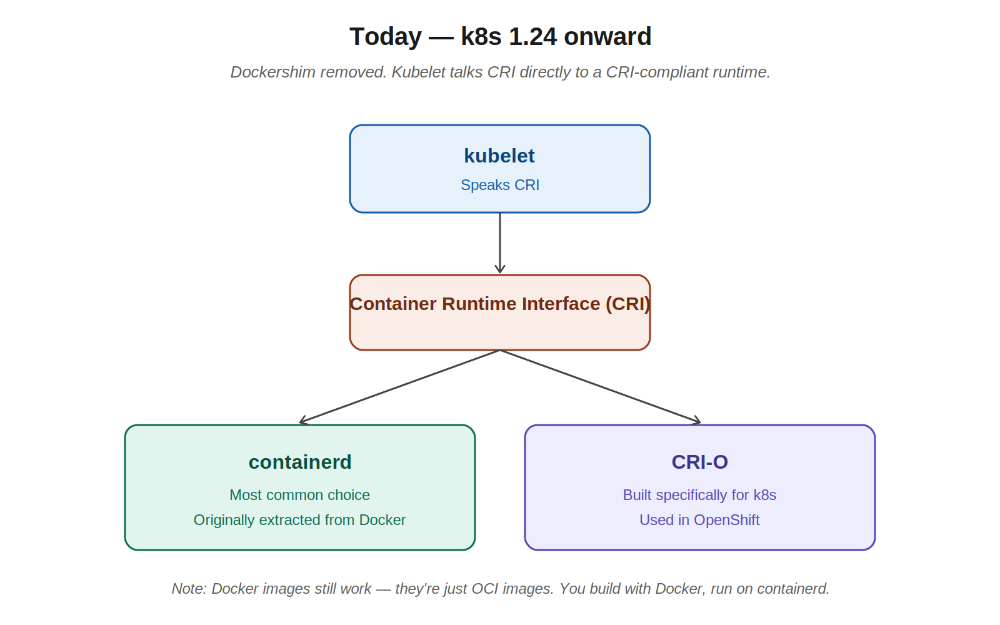
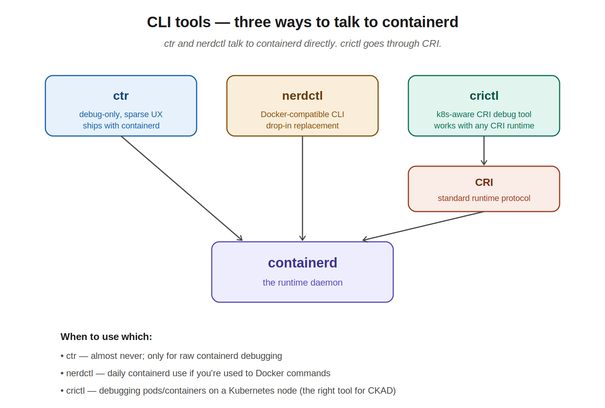

# 02 — Containers, Docker, containerd, CRI, OCI

> This chapter is mostly *context*. The instructor walks through it with images and minimal narration, but the topic matters because every CKAD environment today uses containerd (not Docker), and the debug commands you'll use on the exam (`crictl`, not `docker`) come from this evolution.

---

## 1. What is a "container runtime"?

A **container runtime** is the piece of software on a node that actually runs containers. It pulls images from a registry, unpacks them, sets up the namespaces and cgroups that isolate a container from the host, starts the process, and tears it down when it's done.

It is **not** Kubernetes. It is **not** the kubelet. It sits *below* the kubelet on every worker node, and the kubelet talks to it to start and stop containers.

Examples of container runtimes:
- **Docker** (specifically `dockerd`) — the original popular runtime
- **containerd** — extracted from Docker, now the default in most clusters
- **CRI-O** — built specifically for Kubernetes, used in OpenShift
- **rkt** (pronounced "rocket") — early competitor to Docker, now mostly historical

---

## 2. The evolution: how we got here

This is the story most candidates get tripped up on. It happens in four phases.

### Phase 1: Docker was hardcoded into Kubernetes

In the earliest versions of Kubernetes, Docker was the only supported runtime. The kubelet had Docker API calls baked directly into its source code.

This was fine until other runtimes (rkt, then more) wanted in. Cramming each new runtime into the kubelet codebase wasn't sustainable.

### Phase 2: OCI standards emerge

The **Open Container Initiative (OCI)** was created to standardize containers across the industry, so a container built with one tool could run on another tool's runtime.

OCI maintains two key specifications:

- **imagespec** — defines how container images are packaged: layers, manifest, metadata, configuration. A "Docker image" is really an OCI image.
- **runtimespec** — defines how a runtime should start and manage a container from an unpacked image (filesystem layout, process configuration, lifecycle).

OCI also publishes **runc** — the reference implementation of runtimespec. It's a tiny low-level binary that actually creates the container process. Both **containerd** and **CRI-O** use runc under the hood.

> **Practical takeaway:** when someone says "Docker image," they mean an OCI image. You can build it with Docker on your laptop, and any OCI-compliant runtime (containerd, CRI-O) on a cluster will run it without modification. This is why Docker is still useful for local development even though Kubernetes no longer uses it as a runtime.

### Phase 3: CRI introduced, dockershim era

Kubernetes created the **Container Runtime Interface (CRI)** — a standard plug-in interface so the kubelet could talk to *any* runtime over a defined protocol, instead of hardcoding each one.

The catch: Docker existed before CRI and never spoke CRI. Rather than break Docker support, the Kubernetes team built **dockershim** — a small adapter inside the kubelet that translated CRI calls into Docker API calls.

This worked for years (Kubernetes 1.5 through 1.23), but maintaining dockershim was extra work for the Kubernetes team. Other runtimes (containerd, CRI-O) supported CRI natively, so dockershim was the odd one out.

### Phase 4: Today — dockershim removed

In **Kubernetes v1.24** (released April 2022), dockershim was removed from the Kubernetes codebase. The kubelet now talks CRI directly to whichever CRI-compliant runtime is installed.

Most clusters today run **containerd**. OpenShift and some other distributions run **CRI-O**.

> **Important:** "Docker is removed from Kubernetes" does NOT mean your Docker images stop working. They're OCI images, which containerd runs natively. You can still build with `docker build` on your laptop and deploy to a containerd cluster. The change is internal to the cluster.

---

## 3. What's inside Docker (and why containerd was carved out of it)

Docker is not just a container runtime. It's a bundle of features:

- **CLI** — the `docker` command
- **API** — the daemon's REST API
- **BUILD** — image building (`docker build`)
- **VOLUMES** — managed storage
- **AUTH** — registry credentials
- **SECURITY** — image signing, etc.
- **runtime** — the part that actually runs containers (this part became containerd)

Around 2016, Docker extracted the runtime piece into a standalone project — **containerd** — and donated it to the CNCF. containerd is a smaller, simpler, more focused project: just image transfer, container lifecycle, low-level storage and networking. No CLI ergonomics, no build features, no extras.

That's why containerd is what Kubernetes uses today — it's exactly the runtime piece, without all the developer-experience features the kubelet doesn't need.

---

## 4. CLI tools — who uses what

Three different command-line tools end up in conversations about containerd. They look similar but have different audiences.

### `ctr`
- Ships with containerd itself.
- Made **solely for debugging containerd**, not for everyday use.
- Sparse, awkward UX. Not feature-rich.
- You probably won't use this on the exam or at work.

### `nerdctl`
- A separate project that gives containerd a **Docker-compatible CLI**.
- If you're used to typing `docker run`, `docker ps`, `docker logs`, you can type the same commands as `nerdctl run`, `nerdctl ps`, `nerdctl logs` and they just work.
- Use when you want a friendly CLI for containerd outside of Kubernetes (e.g., on a node directly).

### `crictl`
- Provided by the Kubernetes community.
- Talks to the runtime **through the CRI** — so it works with containerd, CRI-O, or any future CRI-compliant runtime.
- Knows about Kubernetes concepts: pods, pod sandboxes, image references the way k8s sees them.
- **This is the right debugging tool for a Kubernetes node** when something is wrong with how a pod is running.
- Configured via `/etc/crictl.yaml` to point at the node's runtime socket.

---

## 5. docker vs crictl — common command mappings

When debugging on a Kubernetes node, your muscle memory will say `docker ps`, but Docker isn't there. The good news: most `crictl` subcommands match `docker` subcommands one-to-one.

| Task | Docker | crictl |
|---|---|---|
| List running containers | `docker ps` | `crictl ps` |
| List images | `docker images` | `crictl images` |
| View container logs | `docker logs <id>` | `crictl logs <id>` |
| Exec into a container | `docker exec -it <id> sh` | `crictl exec -it <id> sh` |
| Inspect a container | `docker inspect <id>` | `crictl inspect <id>` |
| Attach to a container | `docker attach <id>` | `crictl attach <id>` |
| Show container stats | `docker stats` | `crictl stats` |
| Show daemon info | `docker info` | `crictl info` |
| Show runtime version | `docker version` | `crictl version` |

A few `docker` flags don't have crictl equivalents (`--detach-keys`, `--sig-proxy`, `--privileged` on exec, the `--details` flag on logs). For everyday debugging during the exam, the basic forms above are what you'll reach for.

> **In practice:** for almost everything CKAD-related you should use `kubectl logs` and `kubectl exec`, not `crictl`. You only fall back to `crictl` when something is wrong *below* the kubelet — for example, the kubelet can't start a pod because the runtime is unhealthy. That's a "find the node, ssh in, run crictl" situation.

---

## 6. Mental model for the exam

If you only remember three things from this chapter:

1. **The runtime today is containerd.** Docker is no longer in the cluster as of v1.24.
2. **The protocol between kubelet and runtime is CRI.** Anything that's "CRI-compliant" can be a runtime.
3. **Your image format is OCI.** Build with Docker locally, run on containerd in production. Same image.

---

## Quick recall checklist

- [ ] What is a container runtime, and where does it live?
- [ ] What does OCI standardize? Name the two specs.
- [ ] What is `runc`, and what's its role?
- [ ] Why was dockershim needed, and when was it removed?
- [ ] In a v1.24+ cluster, what runs as the runtime by default?
- [ ] What's the difference between `ctr`, `nerdctl`, and `crictl`?
- [ ] Which CLI tool should you reach for when debugging containers on a Kubernetes node?
- [ ] Can you still build images with `docker build` and deploy to a containerd cluster? Why?

---

## Notes for next chapters

Up next: pods (single vs multi-container, init containers, sidecars).
