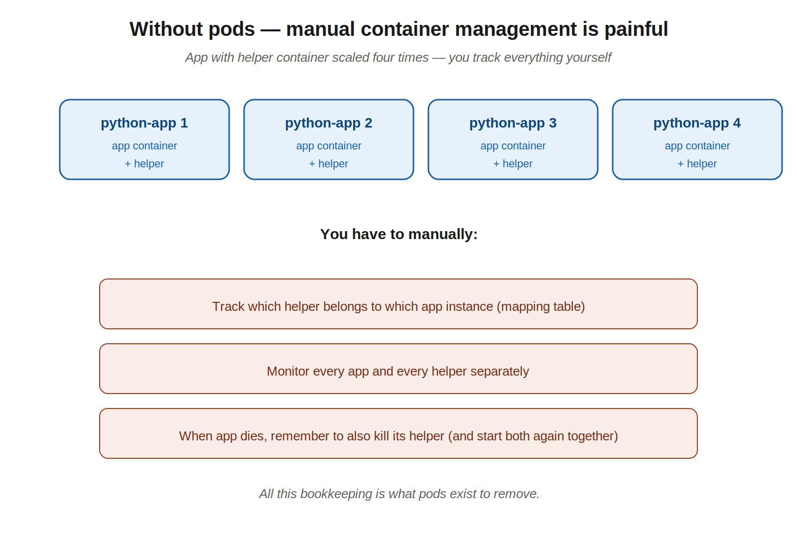
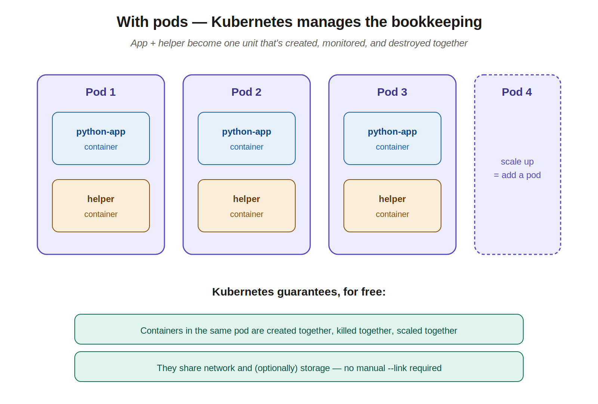
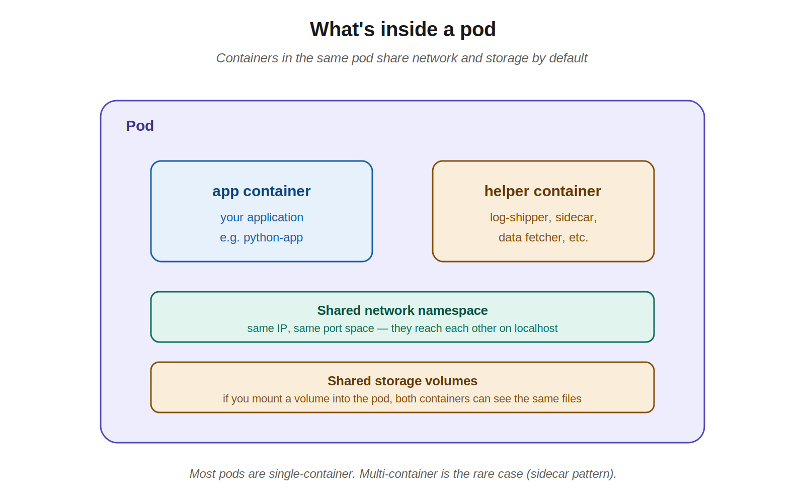
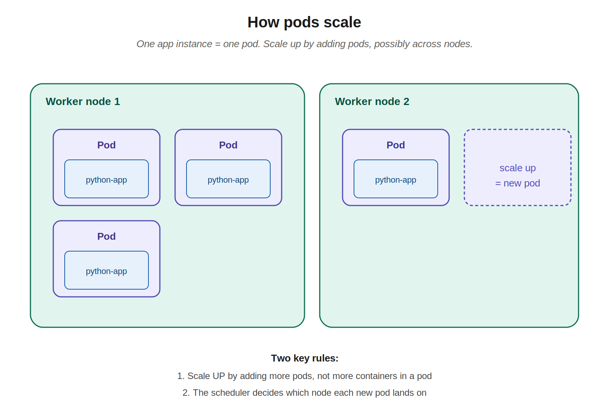

# 03 — Pods

> Pods are the fundamental unit of work in Kubernetes. You don't deploy containers directly to nodes — you deploy pods, and pods contain containers. This is the most-used object on the CKAD exam.

---

## 1. The motivating example

To understand *why* pods exist, walk through what life looks like without them.

Say you have a Python web application packaged as a Docker image. You start with one container:

```bash
docker run python-app
```

Traffic grows, so you scale by running more instances:

```bash
docker run python-app
docker run python-app
docker run python-app
docker run python-app
```

Now the app evolves. You realize it needs a **helper container** alongside each instance — maybe a log shipper, a sidecar that fetches data, a small proxy. So you start helpers and link them:

```bash
docker run helper --link app1
docker run helper --link app2
docker run helper --link app3
docker run helper --link app4
```

You now own a bookkeeping problem:



Specifically, **you** have to:
- Track which helper belongs to which app instance (a mapping table you maintain).
- Monitor each app and each helper separately.
- When an app dies, remember to also kill its helper. When you restart the app, start the helper too — and re-link them.
- When you scale up, repeat the pairing dance.

This is fine at small scale and miserable at any real scale. **Pods solve exactly this problem.**

---

## 2. What a pod is

A **pod** is the smallest deployable unit in Kubernetes. It's a Kubernetes object that wraps one or more containers and treats them as a single unit.



Key guarantees that come for free when containers share a pod:

- **Created together** — when the pod starts, all its containers start.
- **Killed together** — when the pod dies, all its containers die.
- **Scheduled together** — the scheduler places the whole pod on one node. Containers in the same pod always run on the same machine.
- **Scaled together** — there's no such thing as "scale only one container in this pod." Scaling means adding or removing whole pods.

You stop tracking app-helper pairs manually because the pod *is* the pairing.

---

## 3. What's inside a pod

Containers in the same pod share two important things by default:



### Shared network namespace
- All containers in the pod share the same IP address and port space.
- They can reach each other on `localhost` — no service discovery, no DNS, no `--link` flags.
- They cannot use the same port though (just like two processes on one machine can't both bind to port 8080).

### Shared storage volumes
- If you mount a volume into the pod, every container in the pod can see and read/write the same files.
- This is how the helper container in our example would read logs the app writes — both mount the same volume, app writes to a path, helper reads from it.

### What's NOT shared
- Process space (each container still has its own PID 1).
- Filesystem (each container has its own image-based filesystem unless a shared volume is mounted).

---

## 4. Single-container vs multi-container pods

Most pods you'll write contain **exactly one container**. That's the default and the right answer most of the time.

Multi-container pods are a **rare** pattern, used when two processes are so tightly coupled that they truly should live and die together. Common cases:
- **Sidecar** — a helper that augments the main container (log shipper, metrics exporter, proxy).
- **Adapter** — reformats output of the main container for some other system.
- **Ambassador** — proxies the main container's outbound connections.

> **CKAD heuristic:** when you read a question, default to "this is one container per pod." Only reach for multi-container if the question explicitly describes two processes that need to share storage or localhost networking.

---

## 5. How pods scale

You don't scale a pod by adding containers to it. You scale by adding *more pods*.



Two key rules:

1. **One app instance = one pod.** If you need three instances of your app, you need three pods.
2. **The scheduler places each new pod on a node.** Pods can land on any worker node with capacity. Multiple pods of the same app might end up on one node, or spread across several — that's the scheduler's call.

The instructor was deliberately ignoring networking and load balancing for this lesson — those come later (services). For now, just internalize: scaling means more pods.

---

## 6. Running pods with kubectl

Two approaches: **imperative** (run a command, Kubernetes does it) and **declarative** (write a YAML file, apply it). On the CKAD exam you'll mix both — imperative is fast for simple cases and for generating starter YAML, declarative is what you commit to git in real life.

### Imperative — single command

The fastest way to create a pod:

```bash
kubectl run nginx --image=nginx
```

This creates a pod named `nginx` running the `nginx` image. That's it.

To check it:

```bash
kubectl get pods
# NAME    READY   STATUS              RESTARTS   AGE
# nginx   0/1     ContainerCreating   0          3s

# a few seconds later...
kubectl get pods
# NAME    READY   STATUS    RESTARTS   AGE
# nginx   1/1     Running   0          8s
```

Status meanings:
- **ContainerCreating** — image is being pulled, container is starting up.
- **Running** — container is up. The `READY 1/1` means 1 container ready out of 1 in the pod.
- **CrashLoopBackOff** — container started, crashed, Kubernetes is backing off before retrying.
- **ImagePullBackOff** / **ErrImagePull** — image can't be pulled (wrong name? no permissions? bad registry?).

### Other useful imperative commands

```bash
# Describe a pod (status, events, why it's failing)
kubectl describe pod nginx

# Get extra columns including which node the pod landed on
kubectl get pods -o wide

# See the pod's full YAML as Kubernetes stores it
kubectl get pod nginx -o yaml

# Delete a pod
kubectl delete pod nginx

# Logs from a pod
kubectl logs nginx
kubectl logs nginx -f                # follow (tail -f)
kubectl logs nginx --previous        # logs from a crashed previous container

# Shell into a pod
kubectl exec -it nginx -- bash
```

### Declarative — pod manifest YAML

The same pod, written as YAML:

```yaml
apiVersion: v1
kind: Pod
metadata:
  name: nginx
  labels:
    app: nginx
spec:
  containers:
  - name: nginx
    image: nginx
```

Apply it:

```bash
kubectl apply -f pod.yaml
```

Four required top-level fields, every time, in this order in your head:

| Field | What it is |
|---|---|
| `apiVersion` | API group/version for this resource. Plain pods use `v1`. |
| `kind` | The resource type. Here, `Pod`. |
| `metadata` | Identifying info: `name`, `labels`, `namespace`, etc. |
| `spec` | What you actually want — for a pod, the list of containers. |

### The exam-saver pattern: generate YAML from imperative

Don't write pod YAML from scratch on the exam. Generate it:

```bash
kubectl run nginx --image=nginx --dry-run=client -o yaml > pod.yaml
```

`--dry-run=client` means "don't actually create it, just produce the YAML I would have created." You then edit `pod.yaml` to add anything else (env vars, volumes, multiple containers) and `kubectl apply -f pod.yaml`. This is faster and less error-prone than writing YAML by hand.

### Multi-container pod example

For the rare case you do need two containers, the YAML looks like:

```yaml
apiVersion: v1
kind: Pod
metadata:
  name: web-with-helper
spec:
  containers:
  - name: web
    image: nginx
  - name: helper
    image: busybox
    command: ["sh", "-c", "while true; do echo helping; sleep 10; done"]
```

Both containers will share a network namespace (they can hit each other on `localhost`) and any volumes you define at the pod level.

---

## 7. Editing existing pods

Once a pod is running, you have three patterns for changing it. Which one to use depends on whether you have the original YAML and what field you're trying to change.

### Pattern 1 — You have the pod definition file

If you kept `pod.yaml` from when you created it, edit the file and re-apply:

```bash
vim pod.yaml
kubectl apply -f pod.yaml
```

For the small set of editable fields (see below) this updates the live pod in place. For everything else, the API server rejects the change and you fall back to delete-and-recreate (Pattern 2).

### Pattern 2 — You don't have the file: extract it from the cluster

Common when you didn't create the pod yourself, or you lost the file. Pull the live YAML out of the cluster:

```bash
kubectl get pod <pod-name> -o yaml > pod-definition.yaml
```

`pod-definition.yaml` now has the full spec — plus runtime noise Kubernetes added (`status`, `creationTimestamp`, `resourceVersion`, `uid`, `managedFields`). You can leave most of it; `apply` ignores read-only fields. Then edit, delete, recreate:

```bash
vim pod-definition.yaml
kubectl delete pod <pod-name>
kubectl apply -f pod-definition.yaml
```

> **Tip:** for a cleaner file, open it and strip the `status:` block and the auto-added metadata (`creationTimestamp`, `resourceVersion`, `uid`, `managedFields`, `selfLink`). Not required, but easier to read.

### Pattern 3 — `kubectl edit` for in-place changes

For quick tweaks where you don't care about keeping a YAML on disk:

```bash
kubectl edit pod <pod-name>
```

This pulls the live YAML, opens it in `$EDITOR` (vim by default), and applies your changes when you save with `:wq`. No file, no separate apply step.

If you try to change an immutable field, `kubectl edit` will save your edits to a temp file and warn the apply failed — at which point you fall back to delete-and-recreate.

### What you can actually edit on a live pod

This is the gotcha that trips people up. Pod specs are mostly **immutable once the pod is running**. Only these fields can be changed in place:

| Field | Notes |
|---|---|
| `spec.containers[*].image` | Change a container's image (the most common one — e.g., quick version bump) |
| `spec.initContainers[*].image` | Same, for init containers |
| `spec.activeDeadlineSeconds` | Total time the pod is allowed to run |
| `spec.tolerations` | Additions only — can't modify or remove existing tolerations |
| `spec.terminationGracePeriodSeconds` | Can only be lowered (and only to `1` if it was previously positive) |

Everything else — env vars, resource requests/limits, ports, command/args, volumes, most labels — requires **delete and recreate**:

```bash
# 1. Extract and edit
kubectl get pod <name> -o yaml > pod.yaml
vim pod.yaml

# 2. Delete the live pod
kubectl delete pod <name>

# 3. Recreate from the edited file
kubectl apply -f pod.yaml
```

### Editing pods managed by a Deployment is different

If the pod is managed by a Deployment (or ReplicaSet — check `ownerReferences` to confirm), don't edit the pod. Edit the **Deployment**, and the controller rolls out new pods reflecting the change:

```bash
kubectl edit deployment <name>
# Change image, env, resources, anything — the controller rolls out new pods
```

The Deployment's pod template is fully mutable in this sense, because changes always result in *new* pods, not modifications to existing ones. Covered in detail in chapter 05.

---

## 8. Deleting pods

You'll delete pods constantly during lab work — wrong YAML, want to retry from scratch, stuck in `CrashLoopBackOff`. There are several variants. Knowing the right one for the situation saves time.

### By name — the everyday case

```bash
kubectl delete pod nginx
# pod "nginx" deleted
```

The command blocks until the pod is fully gone. By default Kubernetes asks the container to shut down gracefully, waits up to 30 seconds (the **grace period**), and then force-kills it.

### From the file you applied — symmetric with `apply`

```bash
kubectl delete -f pod.yaml
# pod "nginx" deleted
```

Tears down whatever was created from that file. This is the cleanest pattern: `kubectl apply -f` to create, `kubectl delete -f` to remove. You don't have to remember the resource's name.

### By label selector — bulk delete what matches

```bash
# Delete every pod with label app=web (in current namespace)
kubectl delete pod -l app=web

# Across all namespaces
kubectl delete pod -l app=web -A
```

Useful when you've spun up several pods for a test and want to clean them up by tag rather than name.

### All pods in the current namespace

```bash
kubectl delete pods --all
# pod "nginx" deleted
# pod "smoketest" deleted
# ...
```

Or to wipe everything (pods, services, deployments, etc.) in the current namespace:

```bash
kubectl delete all --all
```

> **Be careful with `--all`.** It only acts on the current namespace, but `--all` plus the wrong context (e.g., a shared cluster) is how people delete things they didn't mean to. Always check `kubectl config current-context` first.

### Force-deleting a stuck pod — the `$now` alias

Sometimes a pod sits in `Terminating` forever — the node went away, a finalizer is wedged, or a process inside refuses to exit. Use the force flags:

```bash
kubectl delete pod stuck-pod --force --grace-period=0
```

The `$now` alias from chapter 00 expands to exactly this:

```bash
k delete pod stuck-pod $now
```

What the flags mean:
- `--grace-period=0` — don't wait, kill immediately.
- `--force` — required when grace period is 0; tells the API server to remove the pod record from etcd even if the kubelet hasn't confirmed shutdown.

Use this only when a pod is genuinely stuck. Force-deleting a healthy pod with running processes can leave orphaned containers on the node.

### What `Terminating` status means

After you run `kubectl delete pod ...`:

```bash
kubectl get pods
# NAME    READY   STATUS        RESTARTS   AGE
# nginx   1/1     Terminating   0          4m
```

The pod is in the grace-period window. Kubernetes sent SIGTERM to the container; the app should be cleaning up (closing connections, finishing requests). When the grace period expires, SIGKILL is sent and the pod is removed.

If `Terminating` lingers past 30-60 seconds, that's the situation `$now` is for.

### The "pod keeps coming back" gotcha

If you delete a pod that was created by a Deployment or ReplicaSet:

```bash
kubectl delete pod web-67d46c8c99-cm84s
# pod "web-67d46c8c99-cm84s" deleted

kubectl get pods
# NAME                  READY   STATUS    RESTARTS   AGE
# web-67d46c8c99-pq2lx  1/1     Running   0          3s   ← new one!
```

The Deployment's controller noticed it had fewer pods than `replicas` says, and made a new one. **Deleting a pod managed by a controller does not remove it permanently** — you need to delete the controller (or scale to zero):

```bash
# Remove the Deployment (and its ReplicaSets and Pods)
kubectl delete deployment web

# Or scale to zero pods, leaving the Deployment in place
kubectl scale deployment web --replicas=0
```

This is also why `ownerReferences` in a pod's metadata matters — they tell you what created it, and therefore what you actually have to delete.

---

## 9. Useful kubectl commands cheat sheet for pods

```bash
# Create
kubectl run <name> --image=<image>                            # imperative
kubectl run <name> --image=<image> --dry-run=client -o yaml   # generate YAML
kubectl apply -f pod.yaml                                     # declarative

# Inspect
kubectl get pods                                              # list pods, current namespace
kubectl get pods -A                                           # all namespaces
kubectl get pods -o wide                                      # show node, IP
kubectl get pod <name> -o yaml                                # full spec
kubectl describe pod <name>                                   # detailed status + events

# Debug (you already do these at work)
kubectl logs <name>
kubectl logs <name> -c <container>                            # multi-container pod
kubectl logs <name> -f
kubectl logs <name> --previous
kubectl exec -it <name> -- bash
kubectl exec <name> -- <command>

# Edit
kubectl edit pod <name>                                       # in-place edit (limited fields)
kubectl get pod <name> -o yaml > pod.yaml                     # extract live spec to a file

# Delete
kubectl delete pod <name>                                     # by name
kubectl delete -f pod.yaml                                    # by manifest
kubectl delete pod -l app=web                                 # by label selector
kubectl delete pods --all                                     # all pods in current ns
kubectl delete pod <name> --force --grace-period=0            # force (or use $now)
```

---

## Quick recall checklist

- [ ] Why do pods exist? What problem do they solve that running containers directly on a node creates?
- [ ] What do containers in the same pod share by default?
- [ ] Are most pods single-container or multi-container?
- [ ] How do you scale up the number of running app instances? (Hint: it's NOT by adding containers to a pod.)
- [ ] What command creates a pod imperatively in one line?
- [ ] What does `--dry-run=client -o yaml` do, and why is it valuable on the exam?
- [ ] What are the four required top-level fields in any pod manifest?
- [ ] What does `READY 0/1 STATUS ContainerCreating` mean?
- [ ] If I don't have the pod's YAML file, how do I extract it from the cluster?
- [ ] Which fields can I change on a live pod, and which require delete-and-recreate?
- [ ] What does `kubectl edit pod <name>` do, and when does it fail?
- [ ] Why is editing a Deployment more flexible than editing a Pod?
- [ ] How do I delete a pod by name? By the file I applied? By label?
- [ ] What does `Terminating` status mean and how long does it normally last?
- [ ] Why does a pod sometimes "come back" after I delete it, and what do I delete instead?
- [ ] When is `--force --grace-period=0` (the `$now` alias) the right answer, and when is it dangerous?

---

## Notes for next chapters

Up next: ReplicaSets and Deployments — the controllers that manage pods for you (so you don't have to manually `kubectl run` ten times to scale, and so dead pods get replaced automatically).
