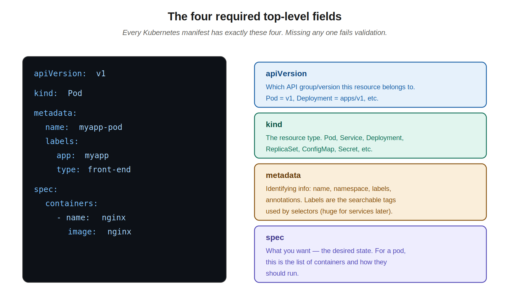
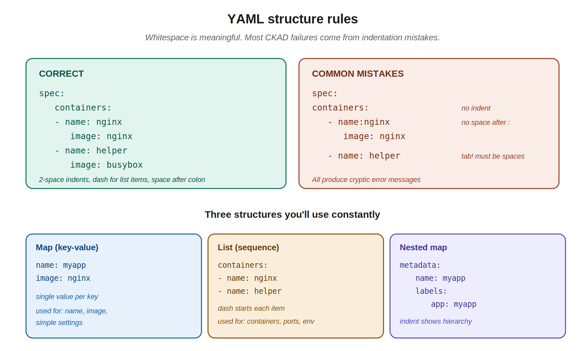
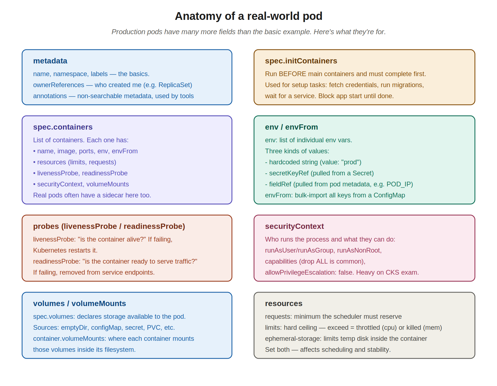

# 04 — Pod YAML manifests

> The instructor's video covered the basics: structure, the four required fields, `kubectl create -f`. This chapter expands on that with YAML rules you need to know, then walks through a real production pod (your JPMC `customer-account-alias-service`) field-by-field so you can read any pod manifest with confidence.

---

## 1. Why YAML?

Kubernetes objects are defined as YAML files (manifests). You write what you want, run `kubectl apply -f file.yaml`, and Kubernetes makes it happen. Every object — pods, deployments, services, configmaps, secrets — uses the same manifest pattern.

You can also create most things imperatively with `kubectl run`, `kubectl create deployment`, etc., but on the exam and in real life you'll spend most of your time in YAML. It's also what gets committed to git, so it's the source of truth for what's running.

> **Tip:** even when you "write" YAML during the CKAD exam, generate the starter with `kubectl run nginx --image=nginx --dry-run=client -o yaml > pod.yaml` and edit from there. Faster and fewer indentation bugs than starting from scratch.

---

## 2. The four required top-level fields

Every Kubernetes manifest has exactly these four fields at the top level. Missing any one fails validation.



```yaml
apiVersion: v1
kind: Pod
metadata:
  name: myapp-pod
  labels:
    app: myapp
    type: front-end
spec:
  containers:
  - name: nginx-container
    image: nginx
```

Apply it:
```bash
kubectl create -f pod-definition.yml      # create only, fails if exists
kubectl apply -f pod-definition.yml       # create or update — preferred
```

### apiVersion (which API)

Tells Kubernetes which API group and version this resource belongs to. The right value depends on the `kind`:

| Kind | apiVersion |
|---|---|
| Pod | `v1` |
| Service | `v1` |
| ConfigMap | `v1` |
| Secret | `v1` |
| ReplicaSet | `apps/v1` |
| Deployment | `apps/v1` |
| Job | `batch/v1` |
| CronJob | `batch/v1` |
| Ingress | `networking.k8s.io/v1` |

Memorize the common ones — Pod and Service are `v1`, deployments are `apps/v1`. If you blank on it, `kubectl explain <resource>` will tell you.

### kind (what type of resource)

The resource type you're creating. The first letter is capitalized (`Pod`, not `pod`).

### metadata (identifying info)

Information *about* the object, not what it does. Common fields:
- `name` — required. Unique within its namespace.
- `namespace` — defaults to `default` if omitted.
- `labels` — searchable key/value tags. **Critical for selectors** (services find pods by label, deployments manage pods by label).
- `annotations` — non-searchable metadata, usually used by tools (e.g., last-applied-configuration, ingress controllers).

### spec (what you want)

The desired state — what this object should actually do. The contents differ by kind:
- For a Pod, `spec.containers` is the main thing.
- For a Deployment, `spec` includes a `template` (which itself is basically a pod spec) and a `replicas` count.
- For a Service, `spec` describes ports and selectors.

---

## 3. YAML rules — what trips people up

YAML uses whitespace to express hierarchy. This is the source of 80% of CKAD frustration if you're new to it.



### Hard rules

1. **Indent with spaces, never tabs.** Two spaces per level is the convention.
2. **A space after every colon.** `name: nginx` works. `name:nginx` does not.
3. **A dash followed by a space starts a list item.** `- name: x` works. `-name: x` does not.
4. **Indentation must be consistent within the same block.** If `containers:` items are indented 2 spaces, all of them must be.

### The three structures you'll use

**Map (key-value pair):**
```yaml
name: myapp
image: nginx
```

**List (sequence):** items start with `- `:
```yaml
containers:
- name: nginx
- name: helper
```

**Nested map:** indent shows the parent-child relationship:
```yaml
metadata:
  name: myapp
  labels:
    app: myapp
```

### A list-of-maps (very common)

Every container in a pod is a map; the `containers` field is a list of those maps:

```yaml
spec:
  containers:
  - name: nginx          # ← dash means "new list item"
    image: nginx         # ← part of same item, indented under it
    ports:               # ← still part of same item
    - containerPort: 80  # ← ports is a list, this is its first item
  - name: helper         # ← new dash, new list item
    image: busybox
```

> **CKAD survival tip:** when YAML breaks, the error is rarely the line that's broken — it's the indentation a few lines above. Run `kubectl apply -f file.yaml --dry-run=client` to validate before you actually apply.

---

## 4. Creating the pod from a manifest

Once you have a manifest (e.g., `pod-definition.yml`), there are two commands that send it to the cluster. They look similar and CKAD questions sometimes use either one — knowing the difference matters.

### `kubectl create -f` — strict create

```bash
kubectl create -f pod-definition.yml
# pod/myapp-pod created
```

- Creates the resource if it doesn't exist.
- **Errors out** if a resource with the same name already exists (`AlreadyExists`).
- Doesn't track its own state for future updates.

Use this when you want a strict "this thing should not exist yet" guarantee.

### `kubectl apply -f` — create or update (preferred)

```bash
kubectl apply -f pod-definition.yml
# pod/myapp-pod created          ← first run
# pod/myapp-pod configured       ← subsequent run with edits
# pod/myapp-pod unchanged        ← subsequent run with no edits
```

- Creates the resource if it doesn't exist.
- **Updates it in place** if it exists, by computing the diff against the previous applied state.
- Stores the last applied YAML in an annotation (`kubectl.kubernetes.io/last-applied-configuration`) so future applies know what changed.

This is the one you'll use 95% of the time. It's idempotent — re-running it on an unchanged file does nothing, and on a changed file does only the minimum.

### What actually happens when you apply a pod

Roughly the sequence:

1. **kubectl** reads the file, validates the YAML structure locally, and POSTs it to the API server.
2. **API server** validates against the schema, runs admission controllers, and writes the object to **etcd**. The pod now exists as a record — but no container is running yet. Status is `Pending`.
3. **Scheduler** notices a pod with no `nodeName`, picks a node with capacity, and writes the assignment back.
4. **kubelet** on the chosen node sees a pod assigned to it, pulls the image (status: `ContainerCreating`), and starts the container via the runtime (containerd/CRI-O).
5. Once the container is up and any probes pass, status flips to `Running`.

This is why `kubectl get pods` right after `apply` often shows `Pending` or `ContainerCreating` for a few seconds — those steps are happening in sequence, asynchronously.

### End-to-end workflow you'll repeat all the time

```bash
# 1. Generate starter YAML (don't write from scratch)
k run myapp --image=nginx $do > pod.yaml

# 2. Edit it — add labels, env, ports, whatever the task needs
vim pod.yaml

# 3. Validate before applying (catches indentation/schema errors)
k apply -f pod.yaml --dry-run=client
k apply -f pod.yaml --dry-run=server   # server-side validation, stricter

# 4. Apply
k apply -f pod.yaml

# 5. Verify
k get pods
k describe pod myapp        # check Events at the bottom if anything looks off
k logs myapp                # confirm the app actually started

# 6. Clean up when done
k delete -f pod.yaml        # delete using the same file you applied
# or: k delete pod myapp
```

> **Exam tip:** when a task says "create a pod with these properties," the fastest path is almost always `k run --image=... $do > pod.yaml`, edit, `k apply -f`. Don't hand-write the four required fields if a `kubectl run` flag will scaffold them for you.

### Common errors at create time

| Error | What it means | First thing to check |
|---|---|---|
| `error: error validating ...` | Schema problem in your YAML | Read the line number — usually a typo'd field or wrong indentation |
| `error: error parsing ...` | YAML itself is malformed | Tabs vs spaces, or a missing `:` / `-` |
| `AlreadyExists` (with `create`) | Resource of that name exists | Use `apply` instead, or `k delete` first |
| Pod stays `Pending` | Scheduler can't place it | `k describe pod` → Events: usually resource limits or a nodeSelector/taint mismatch |
| Pod stuck `ContainerCreating` | kubelet can't start the container | `k describe pod` → usually a missing volume, secret, or configmap referenced in the spec |
| `ImagePullBackOff` | Image can't be pulled | Wrong image name/tag, private registry without `imagePullSecrets`, or no network |

---

## 5. Inspecting pods after creation

Same commands as before, recapped here for completeness:

```bash
# List pods
kubectl get pods
# NAME        READY   STATUS    RESTARTS   AGE
# myapp-pod   1/1     Running   0          20s

# Detailed status, including events showing what happened during startup
kubectl describe pod myapp-pod

# See the FULL stored YAML — including fields Kubernetes added itself
kubectl get pod myapp-pod -o yaml
```

The `describe` output is your debugging gold mine — the **Events** section at the bottom shows in chronological order: scheduled to node, image pulled, container created, container started. When something goes wrong (image pull failed, mount failed, probe failing), it shows up here.

---

## 6. Reading a real-world pod — JPMC walkthrough

The instructor showed a 12-line pod manifest. Production pods are 200+ lines. Here's how to read your `customer-account-alias-service` pod section by section.



### metadata you'll see in production

```yaml
metadata:
  name: customer-account-alias-service-67d46c8c99-cm84s
  namespace: 700515d201053-caas-dev
  labels:
    app: customer-account-alias-service
    appIdentity: caas
    pod-template-hash: 67d46c8c99
  ownerReferences:
  - apiVersion: apps/v1
    controller: true
    kind: ReplicaSet
    name: customer-account-alias-service-67d46c8c99
```

What's going on:
- The pod name has a random suffix (`67d46c8c99-cm84s`). That's because **you didn't create this pod directly** — a Deployment created a ReplicaSet, which created the pod. The random suffix prevents naming collisions when scaling.
- `ownerReferences` confirms this: the pod was created by a ReplicaSet. When the ReplicaSet is deleted, this pod is too (cascade delete).
- `pod-template-hash` is a label the Deployment uses to track which pods belong to which version of the template.
- `namespace` is the JPMC tenant/project namespace — your team's slice of the cluster.

### initContainers — runs first, blocks app start

```yaml
initContainers:
- name: bootstrap-identity-sidecar-init
  image: containers-read.gkp.jpmchase.net/.../bootstrap-identity-sidecar:...
  ...
- name: ic
  image: containers-read.gkp.jpmchase.net/.../ckms-manager:release-2.4...
  ...
```

Init containers run sequentially **before** any of the regular containers start. Each must complete successfully before the next runs. If any fail, the pod fails.

In your pod, the init containers are:
1. **bootstrap-identity-sidecar-init** — sets up identity/auth credentials before the app starts. Probably writes a token or config file the app needs.
2. **ic** — looks like CKMS (cryptographic key management) bootstrap. Sets up encryption keys.

Both finish, drop their files into a shared volume, and exit. Then the main containers start with those credentials already in place.

### Main containers (this pod has three!)

Most apps have one main container. Yours has three — this is sidecar pattern in action:

1. **`customer-account-alias-service`** — the actual Java app (port 8080)
2. **`logging-sidecar`** — runs `fluent-bit`, ships logs from the app's `/app/logs` to Splunk
3. **`caas-otel-collector`** — runs OpenTelemetry, collects metrics/traces from the app

The three containers share `/app/logs` via a `caas-logs` volume. The main app writes logs there; the sidecar reads from there and ships them. Classic sidecar pattern, exactly the multi-container use case the previous chapter mentioned.

### env: where do environment variables come from?

The instructor didn't cover this but it's all over your work pod and on the exam. There are **three sources** for env values:

```yaml
env:
- name: JAVA_OPTS
  value: -XX:MaxDirectMemorySize=20M ...           # 1. hardcoded value

- name: APP_SSL_KEYSTORE_PASSWORD
  valueFrom:
    secretKeyRef:                                  # 2. pulled from a Secret
      key: keystore-password
      name: caas-tls

- name: INFO_KUBE_NAMESPACE
  valueFrom:
    fieldRef:                                      # 3. pulled from pod metadata
      fieldPath: metadata.namespace
```

The three patterns:
1. **Hardcoded** — `value: "literal"`. Plain string baked into the manifest.
2. **secretKeyRef** — pulls a value out of a Kubernetes Secret. The secret must exist in the same namespace. Used for passwords, API keys, certs.
3. **fieldRef** — Kubernetes injects information about the pod itself. Common ones: `metadata.namespace`, `metadata.name`, `status.podIP`, `spec.nodeName`. This is how the app learns "what pod am I, what node am I on" without hardcoding.

### envFrom: bulk-import a ConfigMap

Your pod also has:

```yaml
envFrom:
- configMapRef:
    name: app-runtime-customer-account-alias-service-gt8742hhm7
```

This says: "take every key in that ConfigMap and inject it as an environment variable." Saves writing 30 lines of `name: x, value: y` when your app needs lots of config.

### Probes: livenessProbe and readinessProbe

Your app has both:

```yaml
livenessProbe:
  httpGet:
    path: /health
    port: 8080
    scheme: HTTP
  initialDelaySeconds: 60
  periodSeconds: 10
  failureThreshold: 3
  timeoutSeconds: 5
readinessProbe:
  # same as above
```

Two different questions, two different probes:

| Probe | Question | Failure consequence |
|---|---|---|
| **livenessProbe** | Is this container alive (not deadlocked, not stuck)? | Kubernetes kills and restarts it |
| **readinessProbe** | Is this container ready to handle traffic *right now*? | Removed from service endpoints (no traffic sent), but NOT killed |

Your app says: hit `/health` on port 8080 over HTTP every 10 seconds, after waiting 60 seconds for startup. If 3 in a row fail, treat it as unhealthy.

The three probe types you can use:
- **httpGet** — make an HTTP request, expect 2xx/3xx response
- **tcpSocket** — try to open a TCP connection, succeeds if it opens
- **exec** — run a command inside the container, succeeds if exit code 0

There's also a third probe type, **startupProbe** — runs once at container start to handle slow-starting apps (some Java apps take 90 seconds to boot). Useful when liveness `initialDelaySeconds` isn't enough.

### resources: requests and limits

```yaml
resources:
  limits:
    ephemeral-storage: 100Mi
  requests:
    ephemeral-storage: 100Mi
```

Two concepts:
- **requests** — "I need at least this much." Used by the scheduler to decide which node has room. Reserved for your container.
- **limits** — "I should never use more than this." Hard ceiling. CPU over-limit = throttled. Memory over-limit = container is killed (OOMKilled).

Your pod only sets `ephemeral-storage` (temp disk). Production pods usually also set `cpu` and `memory`:

```yaml
resources:
  requests:
    cpu: "500m"            # 0.5 CPU
    memory: "512Mi"
  limits:
    cpu: "1000m"           # 1 CPU
    memory: "1Gi"
```

Setting requests is essential — without them, the scheduler can't make good decisions and pods can starve each other.

### securityContext

```yaml
securityContext:
  allowPrivilegeEscalation: false
  capabilities:
    drop:
    - ALL
  runAsGroup: 999
  runAsNonRoot: true
  runAsUser: 999
  seccompProfile:
    type: RuntimeDefault
```

Defines who runs the process and what they can do. JPMC has locked this down well:
- **runAsNonRoot: true** — refuse to start if the image tries to run as root
- **runAsUser/runAsGroup: 999** — explicitly run as user 999 (a non-root user the image must support)
- **capabilities.drop: ALL** — strip every Linux capability (no `CAP_NET_ADMIN`, etc.)
- **allowPrivilegeEscalation: false** — process can't gain more privileges than it started with
- **seccompProfile** — restrict syscalls

This is on the **CKS exam**, not CKAD, but you'll see it in real pods constantly.

### volumes and volumeMounts

This trips up almost everyone the first time. Two halves:

**`spec.volumes`** (at the pod level) declares what storage exists:

```yaml
spec:
  volumes:
  - name: caas-logs
    emptyDir: {}                # temp dir, lives as long as the pod
  - name: caas-tls
    secret:
      secretName: caas-tls      # mount a secret as files
  - name: kcc
    configMap:
      name: kcc-config          # mount a configmap as files
```

**`container.volumeMounts`** (per container) says where to mount each declared volume *inside that container's filesystem*:

```yaml
containers:
- name: customer-account-alias-service
  volumeMounts:
  - mountPath: /app/logs
    name: caas-logs                  # ← matches spec.volumes name
  - mountPath: /etc/tls
    name: tls-stores
    readOnly: true
```

The `name` field links the two halves. The volume is declared once at the pod level, mounted into multiple containers — that's how the sidecar reads logs the main app wrote.

---

## 7. The template-edit-apply workflow — your CKAD time-saver

The single biggest time-saver on the CKAD exam is *not* writing YAML from memory. You generate a starter manifest with one command, edit the parts the question asks for, and apply. Five steps, repeated all day:

```
1. Generate template      k run nginx --image=nginx $do > pod.yaml
2. Save to file           ... > pod.yaml (already done by step 1)
3. Edit with vim          vim pod.yaml
4. Apply                  k apply -f pod.yaml
5. Verify                 k get pods   /   k describe pod nginx
```

### Why this beats writing YAML from memory

- **Faster.** Two commands gets you 90% of the YAML; you only edit the bits the question requires.
- **Fewer typos.** No more "I wrote `apiVersions` instead of `apiVersion` and lost five minutes."
- **Fewer wrong field names.** kubectl knows the correct field names; you don't have to recall whether it's `containerPort` or `port` or `targetPort`.
- **Consistent indentation.** kubectl emits valid YAML; you don't fight the spaces-vs-tabs problem on a fresh file.

The only time *not* to use it is when you can finish the task without writing a file at all (see decision tree below).

### Two generator commands you need to know

| Command | What it generates |
|---|---|
| `kubectl run` | Pods only |
| `kubectl create` | Everything else (deployments, services, configmaps, secrets, jobs, cronjobs, namespaces, ...) |

That's it. There's no `kubectl generate` — these two cover the entire CKAD curriculum. (`kubectl expose` is a convenience for generating services from existing workloads; treat it as a special case of `create`.)

### Pod generation — `kubectl run`

The `$do` alias from chapter 00 (`--dry-run=client -o yaml`) is what makes these one-liners. Reminder of what it expands to: print the YAML, don't actually create the resource.

```bash
# Basic — just an image
k run nginx --image=nginx $do > pod.yaml

# Expose a port
k run nginx --image=nginx --port=80 $do > pod.yaml

# Run a custom command (overrides the image's default CMD)
k run busybox --image=busybox --command -- sleep 3600 $do > pod.yaml

# Set environment variables (--env can repeat)
k run web --image=nginx --env="ENV=prod" $do > pod.yaml

# Add labels (comma-separated key=value pairs)
k run nginx --image=nginx --labels="app=web,tier=frontend" $do > pod.yaml

# Specify a namespace (must already exist)
k run nginx --image=nginx -n my-namespace $do > pod.yaml
```

Combine flags freely — they all work together. `k run nginx --image=nginx --port=80 --labels="app=web" -n production $do > pod.yaml` is a perfectly normal one-liner.

### Other resources — `kubectl create`

```bash
# Deployment with 3 replicas
k create deployment web --image=nginx --replicas=3 $do > deploy.yaml

# Service exposing a deployment (the deployment must already exist for `expose`)
k expose deployment web --port=80 --target-port=8080 $do > svc.yaml

# ConfigMap from literal values (--from-literal can repeat)
k create configmap app-config --from-literal=ENV=prod $do > cm.yaml

# Secret (generic) from literals — base64-encoded for you
k create secret generic db-creds --from-literal=username=admin $do > secret.yaml

# Job that runs once
k create job pi --image=perl -- perl -Mbignum=bpi -wle "print bpi(100)" $do > job.yaml

# CronJob on a schedule (cron format — every 6 hours here)
k create cronjob backup --image=busybox --schedule="0 */6 * * *" -- echo "backup" $do > cron.yaml

# Namespace
k create namespace dev $do > ns.yaml
```

Two things to watch:
- **Order of `--` and `$do`.** When the resource takes a command (job, cronjob, run with `--command`), the `--` introduces the command and `$do` goes *before* the redirect. The shell expands `$do` first, so the final argv order is correct.
- **`--from-literal=KEY=VALUE`.** No quotes around the whole thing; quote only if the value has spaces.

### Worked example — full CKAD-style task

> **Task:** Create a pod named `webserver` running `nginx`, with label `tier=frontend`, exposing port 80, in namespace `production`.

Step 1 — make sure the namespace exists:

```bash
k get ns production
# If missing:  k create namespace production
```

Step 2 — generate the template:

```bash
k run webserver --image=nginx --labels="tier=frontend" --port=80 -n production $do > pod.yaml
```

Step 3 — open in vim and review:

```bash
vim pod.yaml
```

You'll see something like:

```yaml
apiVersion: v1
kind: Pod
metadata:
  creationTimestamp: null
  labels:
    tier: frontend
  name: webserver
  namespace: production
spec:
  containers:
  - image: nginx
    name: webserver
    ports:
    - containerPort: 80
    resources: {}
  dnsPolicy: ClusterFirst
  restartPolicy: Always
status: {}
```

Spot-check: name correct, image correct, label correct, port correct, namespace correct. The `creationTimestamp: null`, empty `resources: {}`, and `status: {}` are noise — kubectl puts them there but they don't fail the apply. Leave them, or delete them for tidiness.

Step 4 — apply:

```bash
k apply -f pod.yaml
# pod/webserver created
```

Step 5 — verify:

```bash
k get pod webserver -n production
# NAME        READY   STATUS    RESTARTS   AGE
# webserver   1/1     Running   0          8s

k get pod webserver -n production --show-labels
# Confirms tier=frontend is set
```

Total time, with practice: ~60 seconds. Hand-writing this from scratch is closer to 4-5 minutes plus debugging time when you fat-finger the indentation.

### Decision tree — when to use the workflow vs. just running imperatively

```
Does the question say "create a YAML file" or "write a manifest"?
  YES → template-edit-apply (you must produce a file)
  NO ↓

Does the resource need fields that imperative flags can't express?
(volumes, init containers, probes, multi-container pods,
 securityContext, affinity rules, lifecycle hooks)
  YES → template-edit-apply (no flag exists; you must edit YAML)
  NO ↓

Is it a simple "run X with image Y, expose port Z"?
  YES → just `k run` or `k create` directly, no file. Faster.
```

Most exam tasks fall in the first two buckets. Real life leans the same way — "run nginx" is a one-off; anything you'll keep in git wants a file.

### `kubectl edit` — for live in-cluster changes

If a resource already exists and you need to tweak it, `k edit` opens its current YAML in vim, lets you change it, and applies the change on save:

```bash
k edit pod webserver -n production
```

Caveats:
- **Some fields are immutable on live pods.** You can't change `spec.containers[].image`, ports, or most container fields on an existing pod via `edit` — it'll error or silently no-op. Pods generally need delete-and-recreate.
- **Deployments are far more forgiving.** Most deployment fields can be edited live; the controller rolls out the change.
- **Use this sparingly.** A live edit isn't reproducible — nothing in git changed. For anything you'll need to re-do, edit your local file and `k apply -f` instead.

---

## 8. Cheat sheet — pod YAML scaffolding

Memorize this scaffold. You can write a working pod manifest from memory using it:

```yaml
apiVersion: v1
kind: Pod
metadata:
  name: my-pod
  labels:
    app: my-app
spec:
  containers:
  - name: my-container
    image: my-image:tag
    ports:
    - containerPort: 8080
    env:
    - name: ENV_VAR
      value: "some-value"
    resources:
      requests:
        cpu: "100m"
        memory: "128Mi"
      limits:
        cpu: "500m"
        memory: "256Mi"
```

Apply with:
```bash
kubectl apply -f pod.yaml
```

Validate before applying:
```bash
kubectl apply -f pod.yaml --dry-run=client
kubectl apply -f pod.yaml --dry-run=server   # server-side validation
```

### Generation shortcuts (the grep-able list)

Reminder: `$do` = `--dry-run=client -o yaml`. Set up in chapter 00.

```bash
# Pods (kubectl run)
k run nginx --image=nginx $do > pod.yaml
k run nginx --image=nginx --port=80 $do > pod.yaml
k run nginx --image=nginx --labels="app=web,tier=frontend" $do > pod.yaml
k run nginx --image=nginx --env="ENV=prod" $do > pod.yaml
k run nginx --image=nginx -n my-namespace $do > pod.yaml
k run busybox --image=busybox --command -- sleep 3600 $do > pod.yaml

# Deployments
k create deployment web --image=nginx --replicas=3 $do > deploy.yaml

# Services (from existing workload)
k expose deployment web --port=80 --target-port=8080 $do > svc.yaml

# ConfigMaps and Secrets
k create configmap app-config --from-literal=ENV=prod $do > cm.yaml
k create secret generic db-creds --from-literal=username=admin $do > secret.yaml

# Jobs and CronJobs
k create job pi --image=perl -- perl -Mbignum=bpi -wle "print bpi(100)" $do > job.yaml
k create cronjob backup --image=busybox --schedule="0 */6 * * *" -- echo "backup" $do > cron.yaml

# Namespaces
k create namespace dev $do > ns.yaml

# Edit an existing resource live
k edit pod <name>
k edit deployment <name>
```

---

## Quick recall checklist

- [ ] What are the four required top-level fields in any Kubernetes manifest?
- [ ] What's the difference between `kubectl create -f` and `kubectl apply -f`?
- [ ] Why is YAML indentation with tabs a bug? Spaces only?
- [ ] What does `apiVersion: v1` apply to? When do you use `apps/v1`?
- [ ] What are the three sources of values in `env:` (hardcoded, secretKeyRef, fieldRef)?
- [ ] What does an init container do, and when does it run?
- [ ] What's the difference between livenessProbe and readinessProbe?
- [ ] What's the difference between `requests` and `limits` in resources?
- [ ] How do `spec.volumes` and `container.volumeMounts` work together?
- [ ] What does `--dry-run=client -o yaml` do, and why use it on the exam?
- [ ] Can I generate a pod YAML from the command line in one shot?
- [ ] What's the kubectl flag combo to print YAML without applying it?
- [ ] Which kubectl command generates pod YAML? Which one generates deployment YAML, service YAML, configmap YAML?
- [ ] For which fields do I need to edit the generated YAML rather than passing flags? (volumes, init containers, probes, multi-container)

---

## Notes for next chapters

Up next: ReplicaSets and Deployments. The pod you saw at JPMC was created by a ReplicaSet (look at the `ownerReferences`) which was created by a Deployment. Once we cover those, the full picture of "how does my app actually get running and stay running" snaps into focus.
