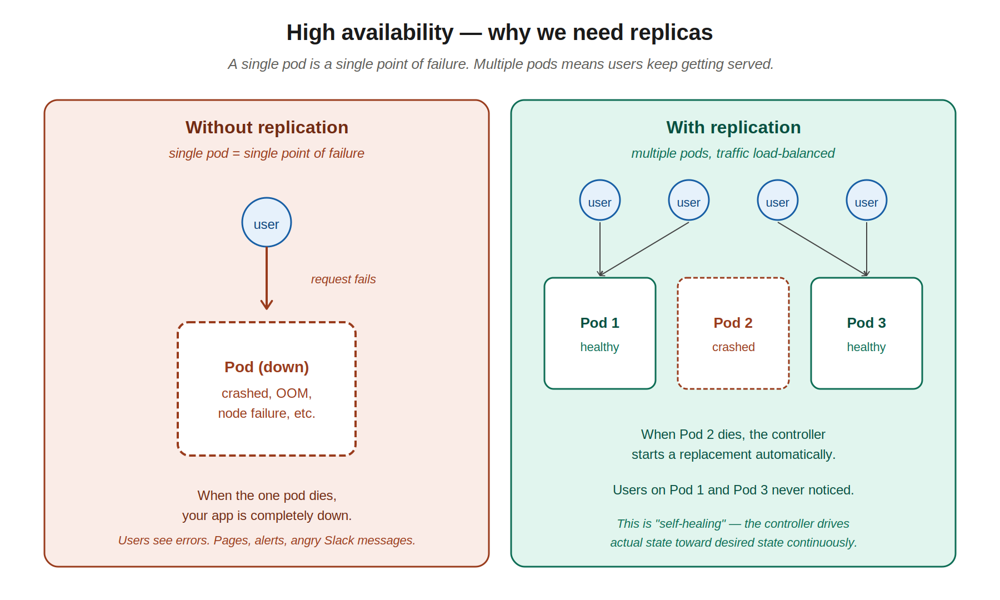
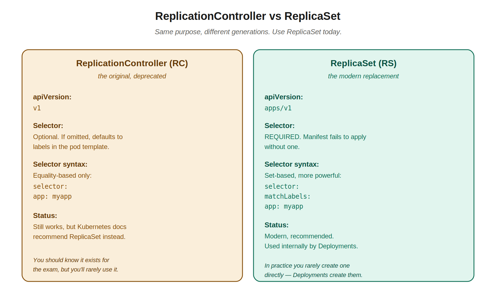
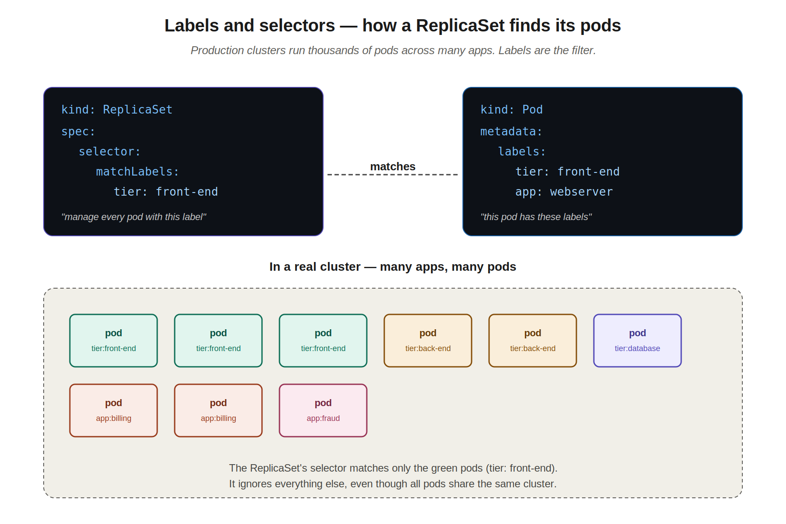
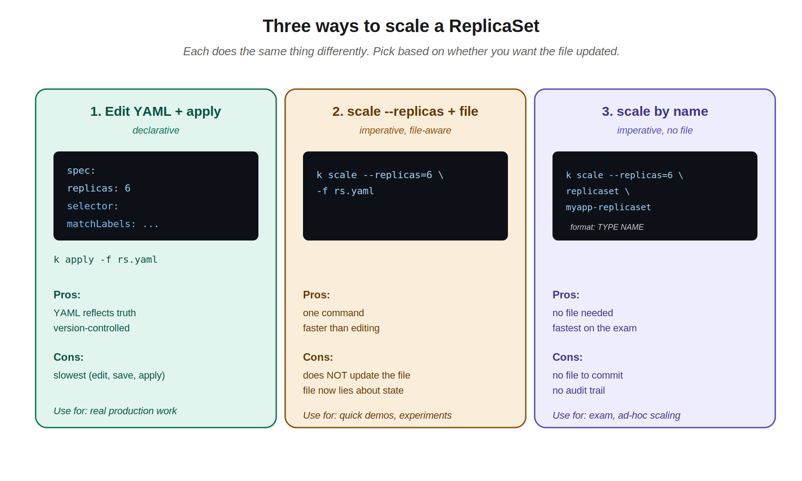

# 05 — ReplicationController and ReplicaSet

> Pods alone are fragile. If a pod dies, it stays dead. ReplicationController and ReplicaSet are controllers that watch your pods and keep the right number of them running. This is what makes Kubernetes self-healing.

---

## 1. The high availability problem

A single pod is a single point of failure. If it crashes, the application is down. If the node it's on goes down, the application is down.

In real production environments, you don't run one of anything. At Visa we ran 4 pods per app in prod, 3 in CTE — minimum, by policy. JPMC almost certainly has similar minimums. The reasons:

- **Resilience to pod crashes** — if one pod OOMs or hits a bug, the others keep serving traffic.
- **Resilience to node failures** — pods land on different nodes, so a node going down only takes some replicas with it.
- **Load distribution** — incoming requests get spread across pods, so no single pod is overwhelmed.



The big idea: **even with a single replica**, the controller still gives you self-healing. If your one pod dies, the controller starts a replacement. So even when you only need one running instance, you should still use a controller to manage it — never just create a bare pod.

> **Real-world story (cautionary tale):** at Visa, a memory issue in one team's app caused a node to fail. Other apps running on that node — including ours — were affected. Senior management pinned the blame on my manager, even though the root cause was an unrelated team's bug. This is part of why production policies mandate multiple replicas spread across nodes: a single-pod failure should never take down the whole app, regardless of which node it lands on. The controller-managed replicas pattern is what makes that recovery automatic.

---

## 2. ReplicationController vs ReplicaSet

There are two flavors of this concept. They do the same thing — keep N copies of a pod running — but differ in age and capabilities.



| | ReplicationController (RC) | ReplicaSet (RS) |
|---|---|---|
| **apiVersion** | `v1` | `apps/v1` |
| **Selector** | Optional (defaults to pod template labels) | **Required** |
| **Selector syntax** | Equality only | Set-based (more powerful, e.g. `In`, `NotIn`, `Exists`) |
| **Status** | Older, deprecated for new use | Modern, recommended |
| **Used by Deployments?** | No | Yes (Deployments create RS internally) |

You'll see RC in older tutorials and legacy clusters. The CKAD course covers it for completeness, but **in real life and on the exam, ReplicaSet is what you write**. And in real life, you usually don't even write a ReplicaSet directly — you write a Deployment, which creates the ReplicaSet for you. (Deployments are the next chapter.)

---

## 3. ReplicationController YAML

For reference and exam awareness:

```yaml
apiVersion: v1
kind: ReplicationController
metadata:
  name: myapp-rc
  labels:
    app: myapp
    type: front-end
spec:
  replicas: 3
  template:
    metadata:
      name: myapp-pod
      labels:
        app: myapp
        type: front-end
    spec:
      containers:
      - name: nginx-container
        image: nginx
```

Key thing to notice: the `spec` contains a `template`, and the template is itself a pod definition (everything from a pod's `metadata` and `spec` goes inside it). The RC is essentially saying: "here's a pod template — keep 3 of these running at all times."

Apply and check:

```bash
kubectl create -f rc-definition.yml
kubectl get replicationcontroller
# NAME       DESIRED   CURRENT   READY   AGE
# myapp-rc   3         3         3       19s

kubectl get pods
# NAME             READY   STATUS    RESTARTS   AGE
# myapp-rc-9dd19   1/1     Running   0          45s
# myapp-rc-9jtpx   1/1     Running   0          45s
# myapp-rc-hq84m   1/1     Running   0          45s
```

Notice the pod names — they get the RC's name plus a random suffix. The same pattern applies to ReplicaSet (and later, Deployments).

---

## 4. ReplicaSet YAML

Modern version:

```yaml
apiVersion: apps/v1
kind: ReplicaSet
metadata:
  name: myapp-replicaset
  labels:
    app: myapp
    type: front-end
spec:
  replicas: 3
  selector:                    # ← REQUIRED for ReplicaSet
    matchLabels:
      type: front-end
  template:
    metadata:
      name: myapp-pod
      labels:
        app: myapp
        type: front-end
    spec:
      containers:
      - name: nginx-container
        image: nginx
```

Two important differences from the RC version:
1. **`apiVersion: apps/v1`** — not `v1`
2. **`selector` is required** — and uses the `matchLabels` form

Apply and check:

```bash
kubectl create -f replicaset-definition.yml
kubectl get replicaset
# NAME               DESIRED   CURRENT   READY   AGE
# myapp-replicaset   3         3         3       19s

kubectl get pods
# NAME                     READY   STATUS    RESTARTS   AGE
# myapp-replicaset-9dd19   1/1     Running   0          45s
# myapp-replicaset-9jtpx   1/1     Running   0          45s
# myapp-replicaset-hq84m   1/1     Running   0          45s
```

---

## 5. Why selectors are required (the labels-and-selectors model)

This is the most important concept in this chapter. The selector is how the ReplicaSet knows *which pods belong to it*. Without it, the RS doesn't know what to manage.



### The mental model

A real cluster runs **thousands of pods** across many applications. At Visa, your team's pods shared a cluster with completely unrelated apps — billing, fraud detection, data pipelines. JPMC is the same. The cluster doesn't care that those apps are unrelated; they're all just pods.

The ReplicaSet has to filter that ocean of pods to figure out which ones are *its* pods. That filter is the selector.

The mechanism:

- **Pods carry labels** in their `metadata.labels` field — arbitrary key/value tags.
- **The ReplicaSet has a selector** in `spec.selector.matchLabels` that specifies which labels to look for.
- **The ReplicaSet manages every pod whose labels match its selector**, ignoring everything else.

### Why this matters in practice

Two scenarios where selectors matter:

**Scenario 1: adopting existing pods.** If pods already exist with labels matching your RS's selector, the RS will adopt them — it counts them toward its replica count and starts managing them. This means the RS won't always create exactly N new pods; it might create fewer if matching pods already exist.

**Scenario 2: avoiding chaos.** If you accidentally write a selector that's too broad (e.g., just `app: backend` when many backends have that label), your ReplicaSet might try to take over pods belonging to other teams. Selectors should be specific enough to uniquely identify *your* pods.

### Selector must match template labels

Critical rule that catches everyone the first time: **the selector's `matchLabels` must match the labels in the pod template's `metadata`**. If they don't match, the API server rejects the manifest with a confusing error.

```yaml
spec:
  selector:
    matchLabels:
      type: front-end           # ← this...
  template:
    metadata:
      labels:
        type: front-end          # ← ...must be present here too
```

If you change the selector but forget to update the template labels, you'll see errors like `"the selector does not match the template labels"` during apply.

---

## 6. Three ways to scale

You've created a ReplicaSet with 3 replicas. Now you need 6. There are three ways.



### Method 1: edit the YAML and re-apply (declarative)

Edit `replicaset-definition.yml`, change `replicas: 3` to `replicas: 6`, save, then:

```bash
kubectl apply -f replicaset-definition.yml
```

**Pros:** the YAML reflects reality. Commit it to git and you have an audit trail.
**Cons:** slowest (open editor, find the line, edit, save, run command).
**Use when:** real production work where the file is the source of truth.

### Method 2: `kubectl scale` with a file

Tell kubectl to scale based on the file's identifier without editing the file:

```bash
kubectl scale --replicas=6 -f replicaset-definition.yml
```

**Pros:** one command, no editor.
**Cons:** the file still says `replicas: 3`. The next person who runs `kubectl apply -f` on it will scale you back down — the file is now lying about the desired state.
**Use when:** quick demos or experiments. Avoid in production.

### Method 3: `kubectl scale` by type and name

Scale by referencing the live resource directly, no file involved:

```bash
kubectl scale --replicas=6 replicaset myapp-replicaset
# Format: kubectl scale --replicas=N TYPE NAME
```

**Pros:** fastest. No file. Perfect for the exam.
**Cons:** no file to commit. If your team manages everything via git, this skips that audit trail.
**Use when:** the CKAD exam, or quick ad-hoc scaling where you don't care about a manifest.

### Auto-scaling — covered later

The instructor mentioned that Kubernetes can scale pods automatically based on CPU, memory, or custom metrics. This is the **HorizontalPodAutoscaler (HPA)** — out of scope for this chapter but you'll meet it in advanced sections. The idea: instead of you saying "replicas: 6", you tell Kubernetes "keep CPU below 70% — add or remove pods as needed."

---

## 7. Editing and deleting

### Edit a live ReplicaSet

```bash
kubectl edit replicaset myapp-replicaset
```

This opens the live YAML in your editor (vim by default). Save and quit (`:wq`) and the changes apply immediately.

**Caveat:** changes to the pod template (image, env vars, etc.) **do NOT affect existing pods**. The ReplicaSet only uses the template when creating *new* pods. To roll out a template change, you have to delete the existing pods (and let the RS recreate them) or use a Deployment, which handles this properly.

### Delete a ReplicaSet

```bash
kubectl delete replicaset myapp-replicaset
```

This deletes the RS *and* all the pods it owns (cascade delete). To delete just the RS but leave the pods:

```bash
kubectl delete replicaset myapp-replicaset --cascade=orphan
```

You'll rarely want this, but it's good to know.

---

## 8. Inspecting a ReplicaSet

```bash
# List replicasets
kubectl get replicaset
kubectl get rs                          # short form

# Detailed status, including events
kubectl describe replicaset myapp-replicaset
kubectl describe rs myapp-replicaset

# See which pods belong to it
kubectl get pods -l type=front-end      # filter by label
kubectl get pods --show-labels          # show all labels on every pod
```

The `-l` flag is the same selector mechanism, just from the kubectl side. Anywhere a controller uses labels to find pods, you can use `-l` from the command line to do the same.

---

## 9. Generating ReplicaSet YAML quickly

Annoyingly, there's no `kubectl create replicaset` imperative command. But you can generate a Deployment and modify it:

```bash
# Deployment YAML is almost identical to ReplicaSet YAML
k create deployment myapp --image=nginx --replicas=3 $do > rs.yaml
```

Then edit `rs.yaml`:
- Change `kind: Deployment` to `kind: ReplicaSet`
- Remove `strategy:` and `progressDeadlineSeconds:` (Deployment-only fields)

In practice, you'll almost never write a ReplicaSet directly on the exam. Deployments are what's tested. This whole chapter is mostly about understanding what's happening *underneath* a Deployment.

---

## 10. kubectl commands cheat sheet

```bash
# Create
kubectl create -f rc-definition.yml             # ReplicationController
kubectl create -f replicaset-definition.yml     # ReplicaSet

# Inspect
kubectl get replicationcontroller               # or 'rc'
kubectl get replicaset                          # or 'rs'
kubectl describe rs <name>
kubectl get pods -l <label>=<value>             # find pods by label

# Scale
kubectl apply -f rs.yaml                        # after editing replicas in file
kubectl scale --replicas=6 -f rs.yaml           # without editing file
kubectl scale --replicas=6 replicaset <name>    # without file at all

# Edit
kubectl edit replicaset <name>

# Delete
kubectl delete replicaset <name>                # cascade: deletes pods too
kubectl delete -f rs.yaml
```

---

## Quick recall checklist

- [ ] What's the difference between ReplicationController and ReplicaSet (apiVersion and selector behavior)?
- [ ] Why does even a single replica benefit from a controller?
- [ ] What does `apiVersion` need to be for a ReplicaSet?
- [ ] What's required in a ReplicaSet that's optional in an RC?
- [ ] What happens if the RS selector doesn't match the pod template labels?
- [ ] What are the three ways to scale a ReplicaSet, and which one updates the YAML file?
- [ ] How do you find every pod with the label `tier=front-end` from the command line?
- [ ] Why don't you usually write ReplicaSets directly in real production?
- [ ] What does `kubectl delete rs <name>` do to the pods underneath? How do you delete the RS but keep the pods?

---

## Notes for next chapters

Up next: **Deployments**. Here's where this all comes together. A Deployment creates and manages a ReplicaSet (which manages pods), and adds rolling updates, rollbacks, and rollout history on top. Remember the JPMC pod from chapter 04? Its `ownerReferences` showed it was created by a ReplicaSet. The next layer up — what created that ReplicaSet — is a Deployment. After the next chapter, you'll have the full picture.
