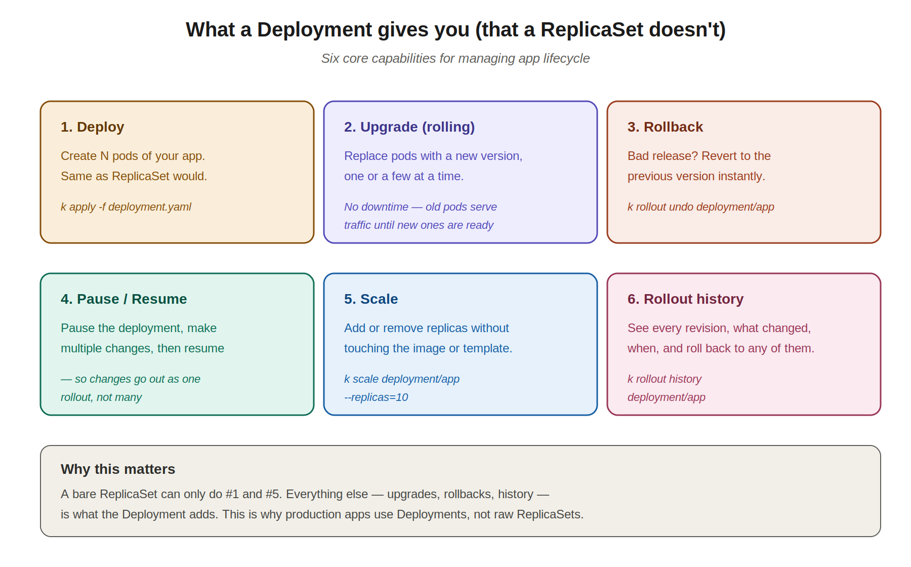
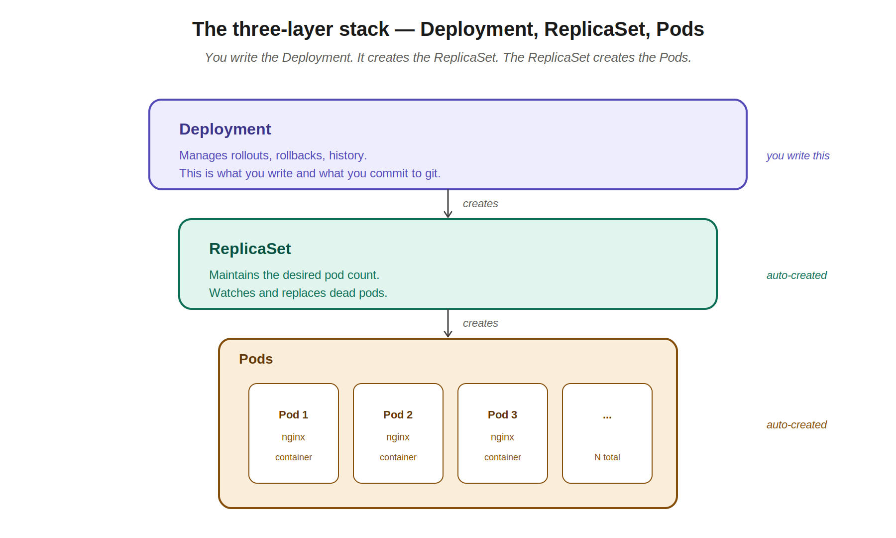
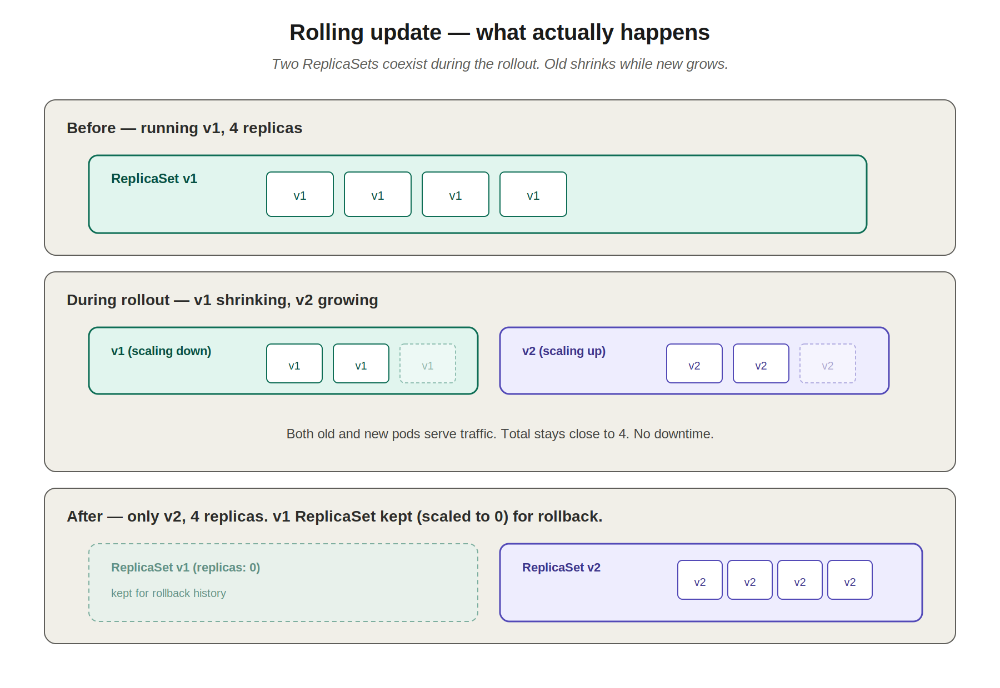

# 06 — Deployments

> Deployments are the workload object you'll write most often in real life. They wrap a ReplicaSet (which wraps pods) and add the things you actually need in production: rolling updates, rollbacks, history, pause/resume. The customer-account-alias-service pod at JPMC was created by a Deployment — chapter 4's `ownerReferences` chain ends here.

---

## 1. Why we need Deployments

When you deploy a real application to a Kubernetes cluster, you need more than just "run N pods." A production lifecycle looks like this:

- **Deploy the application** — start running N pods with version v1.
- **Upgrade the application** — when v2 is released (a new image, a security patch, an updated config), replace the pods one at a time so users see no downtime.
- **Roll back** — if v2 introduces a bug, revert to v1 fast. Bonus points if you don't need a git commit to do it.
- **Pause and resume** — when making multiple changes (new image + new env vars + updated resource limits), pause the deployment, make all changes, then resume so they roll out together as one release rather than triggering three rollouts.
- **Scale** — add or remove replicas without touching the image or any other config.
- **Track history** — see what was deployed when, who changed what, what the previous revisions looked like.

A bare ReplicaSet can only handle "deploy" and "scale." The other four are what a Deployment adds.



---

## 2. The three-layer stack

Here's the most important mental model in this chapter. When you create a Deployment, Kubernetes doesn't create pods directly. It creates a ReplicaSet, and the ReplicaSet creates the pods.



You write the Deployment. The Deployment controller creates a ReplicaSet. The ReplicaSet controller creates the pods.

This is exactly the chain from chapter 4. Remember the JPMC pod's `ownerReferences`?

```yaml
ownerReferences:
- apiVersion: apps/v1
  controller: true
  kind: ReplicaSet
  name: customer-account-alias-service-67d46c8c99
```

The pod is owned by a ReplicaSet. That ReplicaSet is owned by a Deployment named `customer-account-alias-service` (the random suffix `67d46c8c99` is the deployment's pod-template-hash — it identifies *which version* of the deployment created this ReplicaSet). When you upgrade the Deployment, a new ReplicaSet with a different hash gets created.

**Pod names follow the same pattern:**
```
<deployment-name>-<replicaset-hash>-<pod-suffix>
customer-account-alias-service-67d46c8c99-cm84s
└── deployment ──┘ └── ReplicaSet ──┘ └─pod─┘
```

This is how you can look at a pod name and immediately know which Deployment it came from and which version it's running.

---

## 3. Deployment YAML

The good news your instructor mentioned: **the Deployment YAML is almost identical to a ReplicaSet YAML**. Change `kind: ReplicaSet` to `kind: Deployment` and you're 95% of the way there.

```yaml
apiVersion: apps/v1
kind: Deployment                  # ← the only meaningful difference from ReplicaSet
metadata:
  name: myapp-deployment
  labels:
    app: myapp
    type: front-end
spec:
  replicas: 3
  selector:
    matchLabels:
      type: front-end
  template:
    metadata:
      name: myapp-pod
      labels:
        app: myapp
        type: front-end
    spec:
      containers:
      - name: nginx-container
        image: nginx
```

Apply it:

```bash
kubectl create -f deployment-definition.yml
# deployment.apps/myapp-deployment created
```

What you'll observe:

```bash
kubectl get deployments
# NAME               READY   UP-TO-DATE   AVAILABLE   AGE
# myapp-deployment   3/3     3            3           21s

kubectl get replicaset
# NAME                          DESIRED   CURRENT   READY   AGE
# myapp-deployment-6795844b58   3         3         3       2m

kubectl get pods
# NAME                                READY   STATUS    RESTARTS   AGE
# myapp-deployment-6795844b58-5rbjl   1/1     Running   0          2m
# myapp-deployment-6795844b58-h4w55   1/1     Running   0          2m
# myapp-deployment-6795844b58-lfjhv   1/1     Running   0          2m
```

Three commands, three layers. The deployment created a ReplicaSet (`myapp-deployment-6795844b58`), which created three pods. The hash `6795844b58` is the same on the ReplicaSet name and as the second segment of each pod name — that's how you trace ownership.

### Deployment-only fields worth knowing

A few `spec` fields exist on Deployments but not ReplicaSets:

```yaml
spec:
  replicas: 3
  selector:
    matchLabels:
      type: front-end
  strategy:                       # how to do upgrades
    type: RollingUpdate           # or "Recreate" (kill all, then start all)
    rollingUpdate:
      maxSurge: 25%               # how many extra pods can be created above replicas
      maxUnavailable: 25%         # how many can be unavailable during the rollout
  revisionHistoryLimit: 10        # how many old ReplicaSets to keep for rollback
  template:
    ...
```

You won't always set these — the defaults are usually fine — but knowing they exist is exam-relevant.

---

## 4. Rolling updates — how upgrades actually work

The default upgrade strategy is `RollingUpdate`. Here's what happens when you change the image in a Deployment and apply:



1. **Deployment notices the template changed** (different image, env, etc.).
2. **Creates a new ReplicaSet** with the new template. Initial replicas: 0.
3. **Scales the new ReplicaSet up** while scaling the old ReplicaSet down, one or a few pods at a time.
4. **Old and new pods serve traffic simultaneously** during the transition.
5. **When the new ReplicaSet reaches the target count**, the old one is scaled to 0 (but not deleted — it's kept for rollback).

The key insight: **two ReplicaSets exist during a rollout**. The Deployment orchestrates the dance between them.

### The alternative: Recreate strategy

```yaml
strategy:
  type: Recreate
```

This kills all old pods first, *then* starts new pods. Downtime is guaranteed but there's never a mix of versions running. Use this only when your app *cannot* have v1 and v2 running simultaneously (e.g., a database migration that breaks the v1 schema).

`RollingUpdate` is the default and almost always what you want.

### Triggering a rolling update

Two ways:

**Edit the YAML and apply:**
```bash
# Edit deployment-definition.yml, change image from nginx:1.20 to nginx:1.21
kubectl apply -f deployment-definition.yml
```

**Update directly with kubectl:**
```bash
kubectl set image deployment/myapp-deployment nginx-container=nginx:1.21
```

The second form is faster for ad-hoc image bumps. Like the `kubectl scale` trick from chapter 5, **it doesn't update your YAML file** — so the file will lie about reality until you sync it.

---

## 5. Watching a rollout

```bash
# Watch the rollout happen in real time
kubectl rollout status deployment/myapp-deployment
# Waiting for deployment "myapp-deployment" rollout to finish: 1 of 3 updated replicas are available...
# Waiting for deployment "myapp-deployment" rollout to finish: 2 of 3 updated replicas are available...
# deployment "myapp-deployment" successfully rolled out
```

This blocks until the rollout completes or fails. Useful in CI pipelines and exam questions that say "wait until the rollout is done."

```bash
# See the history of revisions
kubectl rollout history deployment/myapp-deployment
# REVISION  CHANGE-CAUSE
# 1         <none>
# 2         <none>
# 3         <none>
```

The `CHANGE-CAUSE` is empty unless you set it. To populate it:

```bash
kubectl annotate deployment/myapp-deployment \
  kubernetes.io/change-cause="Updated nginx to 1.21 for CVE fix"
```

Or include `--record` on the command (deprecated but still works in some kubectl versions):

```bash
kubectl set image deployment/myapp-deployment nginx-container=nginx:1.21 --record
```

In production, set the change cause. It's the only audit trail of what each revision did.

---

## 6. Rollbacks

This is the killer feature. If a deployment is bad — wrong image, missing env var, app crashes — undo it in one command:

```bash
# Roll back to the previous revision
kubectl rollout undo deployment/myapp-deployment

# Roll back to a specific revision
kubectl rollout undo deployment/myapp-deployment --to-revision=2
```

Under the hood: the Deployment scales the *previous* ReplicaSet back up and the current one back down. Same rolling mechanism, in reverse. Takes seconds.

This is why Kubernetes keeps old ReplicaSets around (the `revisionHistoryLimit` field controls how many — default is 10). They're not garbage; they're the rollback points.

---

## 7. Pause and resume

Your instructor mentioned this. When you have multiple changes to make and don't want each one to trigger a separate rollout:

```bash
# Pause the deployment — changes don't trigger rollouts until resumed
kubectl rollout pause deployment/myapp-deployment

# Now make multiple changes — none of them trigger a rollout yet
kubectl set image deployment/myapp-deployment nginx-container=nginx:1.21
kubectl set env deployment/myapp-deployment LOG_LEVEL=debug
kubectl scale deployment/myapp-deployment --replicas=5

# Resume — all changes go out together as one rollout
kubectl rollout resume deployment/myapp-deployment
```

Without pause, each of those three commands would trigger its own rollout — three separate rolling updates back-to-back, each disrupting pods. With pause, you get one clean rollout.

---

## 8. Scaling a Deployment

Same three methods as ReplicaSets (chapter 5):

```bash
# Edit YAML and apply (declarative)
# change spec.replicas: 3 to spec.replicas: 6 in the file
kubectl apply -f deployment-definition.yml

# Imperative with file reference
kubectl scale --replicas=6 -f deployment-definition.yml

# Imperative by type and name (fastest, exam-friendly)
kubectl scale --replicas=6 deployment/myapp-deployment
```

Same trade-offs apply — only the first updates the file.

---

## 9. Generating a Deployment YAML quickly

The imperative shortcut from chapter 4:

```bash
# Generate a deployment YAML and pipe to a file
k create deployment myapp --image=nginx --replicas=3 $do > deployment.yaml

# Then edit to add anything else (env, ports, probes, etc.)
vim deployment.yaml

# Apply
k apply -f deployment.yaml
```

On the exam, this is your default workflow for any "create a deployment" question. Generate, edit if needed, apply.

If you just need to create one quickly with no special config, skip the file entirely:

```bash
k create deployment myapp --image=nginx --replicas=3
```

Useful flags on `kubectl create deployment`:

```bash
# Specify image, port, replicas
k create deployment web --image=nginx --port=80 --replicas=3

# In a specific namespace
k create deployment web --image=nginx -n production
```

Note: `kubectl create deployment` has fewer flags than `kubectl run` for pods. It can't set env vars or labels directly. For those, generate the YAML with `$do` and edit.

---

## 10. Inspecting a Deployment

```bash
# List deployments
kubectl get deployments
kubectl get deploy                    # short form

# Detailed info — events show every rollout action
kubectl describe deployment/myapp-deployment

# See the ReplicaSets it owns
kubectl get rs -l app=myapp

# See the pods it owns
kubectl get pods -l app=myapp

# See the YAML (with status that Kubernetes filled in)
kubectl get deployment/myapp-deployment -o yaml
```

The `describe` output is especially useful — the Events section shows every action the deployment controller took (scaled up RS X, scaled down RS Y, etc.).

### The "show me everything" command — `kubectl get all`

When you just want to see the whole picture in one shot:

```bash
kubectl get all
```

This lists every Deployment, ReplicaSet, Pod, and Service in the current namespace. Sample output right after applying a Deployment:

```
NAME                                    READY   STATUS    RESTARTS   AGE
pod/myapp-deployment-6795844b58-5rbjl   1/1     Running   0          2m
pod/myapp-deployment-6795844b58-h4w55   1/1     Running   0          2m
pod/myapp-deployment-6795844b58-lfjhv   1/1     Running   0          2m

NAME                 TYPE        CLUSTER-IP   EXTERNAL-IP   PORT(S)   AGE
service/kubernetes   ClusterIP   10.96.0.1    <none>        443/TCP   3d

NAME                               READY   UP-TO-DATE   AVAILABLE   AGE
deployment.apps/myapp-deployment   3/3     3            3           2m

NAME                                          DESIRED   CURRENT   READY   AGE
replicaset.apps/myapp-deployment-6795844b58   3         3         3       2m
```

**Why this is useful:**
- You can see the whole Deployment → ReplicaSet → Pods chain in one command.
- Each row is prefixed with the resource type (`pod/`, `deployment.apps/`, etc.), so you don't have to remember which command shows which type.
- Great for quick sanity checks: "did everything I just applied actually come up?"

**What it does NOT show** — and this is important so it doesn't mislead you:
- ConfigMaps, Secrets — not included
- Ingresses, NetworkPolicies — not included
- PersistentVolumes, PersistentVolumeClaims — not included
- Jobs and CronJobs — technically yes (they're workload resources) but often filtered out
- Resources in other namespaces — only the current namespace is shown

Despite the name, it doesn't show *literally* everything. It's a curated view of the most common workload-related resources. For real "everything" you'd need `kubectl api-resources` plus `kubectl get <resource>` for each, which nobody does day-to-day.

Useful variants:

```bash
kubectl get all -A                       # all resources across all namespaces
kubectl get all -n production            # specific namespace
kubectl get all -l app=myapp             # filter by label — show only myapp's stuff
kubectl get all -o wide                  # extra columns (node, IP, etc.)
```

The `-l` form is especially handy in a busy namespace where many apps coexist (like JPMC's CaaS namespaces). `kubectl get all -l app=customer-account-alias-service` would scope the output to just your team's resources.

---

## 11. Deleting a Deployment

```bash
kubectl delete deployment myapp-deployment
# Cascade: also deletes the ReplicaSet and all the pods
```

This is a clean shutdown — Deployment, ReplicaSet, and pods all go away. No orphans.

---

## 12. Mapping back to your JPMC pod

Now you can fully read the JPMC pod's `ownerReferences` from chapter 4:

```yaml
metadata:
  name: customer-account-alias-service-67d46c8c99-cm84s
  ownerReferences:
  - apiVersion: apps/v1
    controller: true
    kind: ReplicaSet
    name: customer-account-alias-service-67d46c8c99
```

Reading the chain:
1. **Pod** `customer-account-alias-service-67d46c8c99-cm84s` belongs to...
2. **ReplicaSet** `customer-account-alias-service-67d46c8c99` (hash `67d46c8c99`), which was created by...
3. **Deployment** `customer-account-alias-service` (a single Deployment can have multiple ReplicaSets over its lifetime, one per revision)

If you ran `kubectl describe deployment customer-account-alias-service` at JPMC, you'd see:
- The replica count your team set (probably 3 or 4 in your dev namespace)
- The strategy (almost certainly `RollingUpdate`)
- The current image (the `containerregistry-na.jpmchase.net/...` reference)
- Recent rollout events
- Resource limits, probes, all the rest from the pod template

Every deployment in JPMC's CaaS environment follows this exact pattern. The pod manifest you uploaded is generated by Kubernetes; the Deployment manifest is what your team actually writes.

---

## 13. kubectl commands cheat sheet — Deployments

```bash
# Create
kubectl create -f deployment.yaml
kubectl create deployment <name> --image=<image>
kubectl create deployment <name> --image=<image> --replicas=3
k create deployment <name> --image=<image> $do > deploy.yaml   # generate YAML

# Inspect
kubectl get deployments                  # or 'deploy'
kubectl get deployment <name> -o yaml
kubectl describe deployment <name>
kubectl get rs -l app=<name>             # find the RSes it owns
kubectl get pods -l app=<name>           # find the pods it owns
kubectl get all                          # Deployments, RSes, Pods, Services in one view
kubectl get all -l app=<name>            # filter to one app's resources
kubectl get all -A                       # all namespaces

# Update
kubectl apply -f deployment.yaml
kubectl set image deployment/<name> <container>=<new-image>
kubectl set env deployment/<name> KEY=value
kubectl edit deployment/<name>           # live edit in your editor

# Rollout management
kubectl rollout status deployment/<name>
kubectl rollout history deployment/<name>
kubectl rollout history deployment/<name> --revision=3
kubectl rollout undo deployment/<name>
kubectl rollout undo deployment/<name> --to-revision=2
kubectl rollout pause deployment/<name>
kubectl rollout resume deployment/<name>
kubectl rollout restart deployment/<name>   # force a rollout (re-pull images, etc.)

# Scale
kubectl scale --replicas=6 deployment/<name>

# Delete
kubectl delete deployment <name>
```

---

## Quick recall checklist

- [ ] What does a Deployment create when you apply it?
- [ ] What's the difference between Deployment and ReplicaSet YAML?
- [ ] What does the random hash in a pod name like `myapp-deployment-6795844b58-cm84s` represent?
- [ ] What are the two rollout strategies, and what's the default?
- [ ] What does `kubectl rollout undo deployment/<name>` actually do under the hood?
- [ ] Why are old ReplicaSets kept around after a rollout?
- [ ] When would you use `kubectl rollout pause` instead of just applying a new YAML?
- [ ] What's the difference between `kubectl set image` and editing the YAML and applying?
- [ ] How would you generate a starter Deployment YAML on the exam in one command?
- [ ] What controls how many old revisions are kept for rollback?
- [ ] Which single command shows you the Deployment, ReplicaSet, Pods, and Services together? What does it NOT show?

---

## Notes for next chapters

Up next: **Services**. Now that you can run multiple pods of your app, you need a stable way for users (or other pods) to reach them. Pods get random IPs that change when they restart — a Service gives you a stable virtual IP that load-balances across whatever pods match its selector. This is the network glue.
