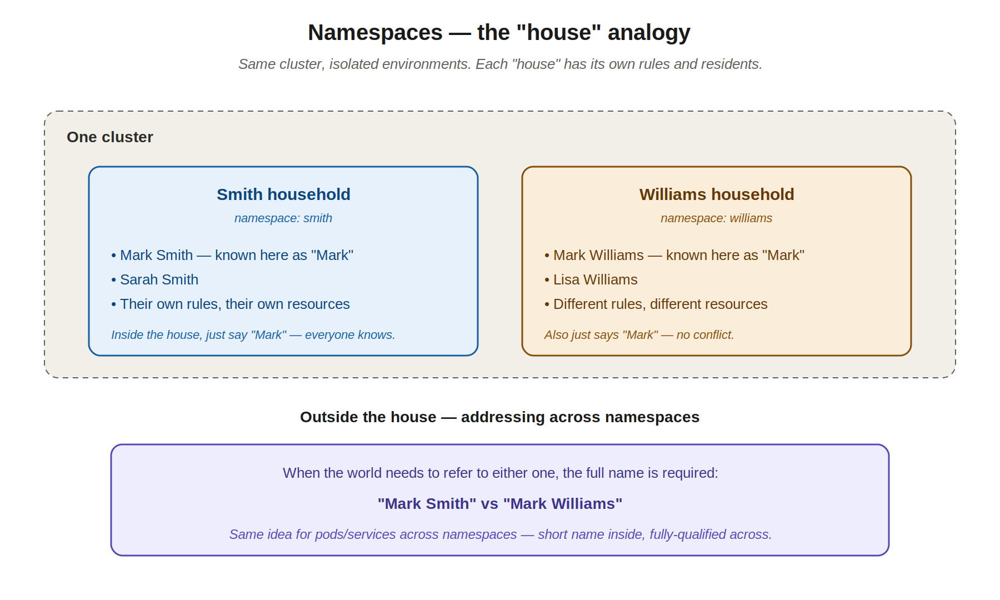
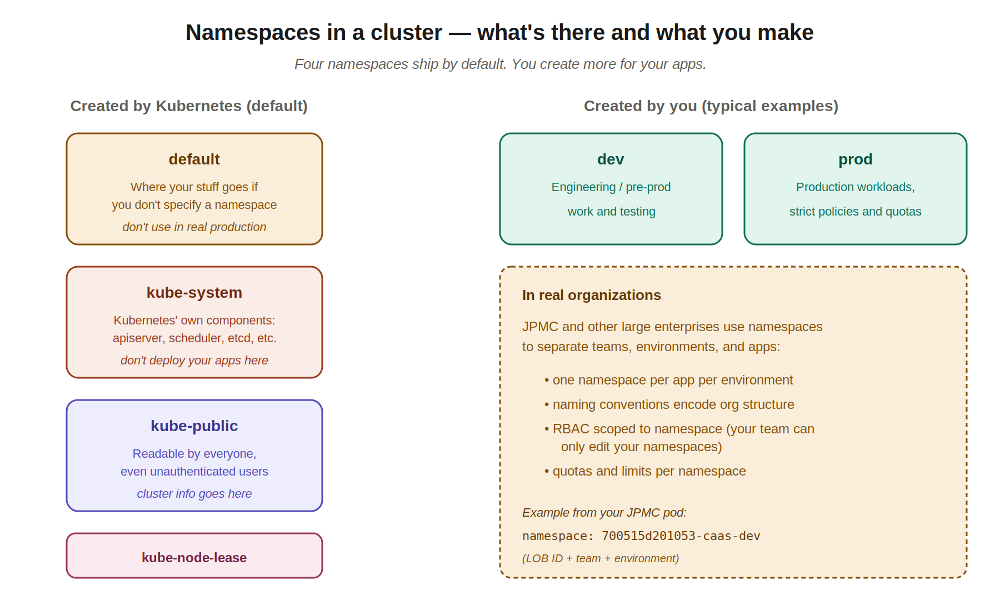
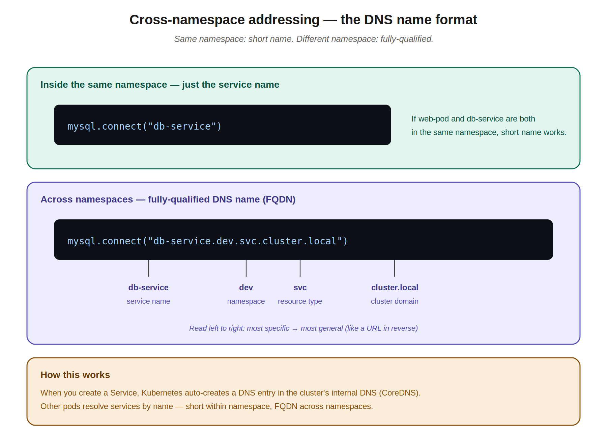
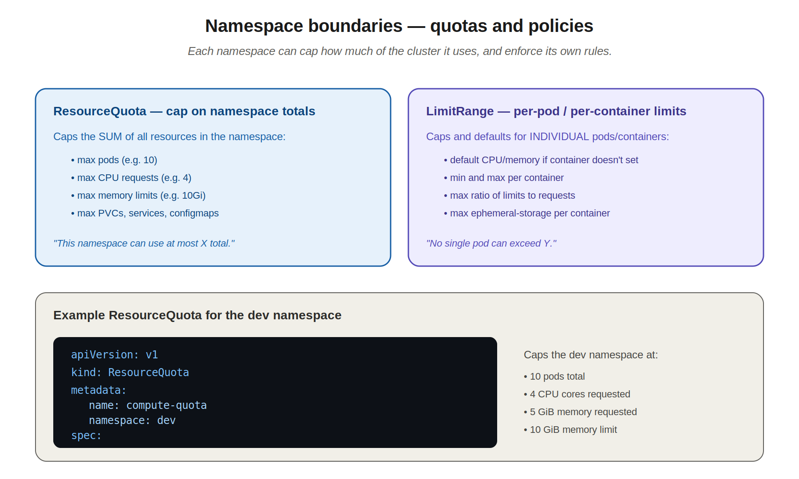

# 07 — Namespaces

> Namespaces partition a cluster into isolated environments. At Visa you logged into specific namespaces to view application logs — that wasn't optional, it was the cluster's way of saying "your team's stuff lives here, other teams' stuff is over there." This chapter explains why.

---

## 1. The "houses" analogy

A namespace is to a Kubernetes cluster what a household is to a neighborhood. Inside one household, you can refer to "Mark" and everyone knows who you mean. In a different household, "Mark" might refer to someone entirely different — and there's no conflict, because the names are scoped to each house.



This is what namespaces do for Kubernetes resources:

- **Same namespace** → you can refer to a service or pod by its short name.
- **Different namespace** → you need the fully-qualified name (covered in section 4).

Each namespace also has:
- Its own resources (pods, services, configmaps, secrets — separate from other namespaces).
- Its own policies (RBAC, network policies, resource quotas).
- Its own limits (more on this in section 7).

This is critical at scale. JPMC's CaaS cluster runs apps from dozens of teams. The customer-account-alias-service pod you uploaded back in chapter 4 lived in `namespace: 700515d201053-caas-dev` — that's the namespace JPMC carved out for your team's dev environment. Other teams have their own namespaces. The cluster is shared; the namespaces aren't.

---

## 2. The four default namespaces

When a Kubernetes cluster is created, four namespaces exist automatically:



| Namespace | Purpose | Don't touch unless |
|---|---|---|
| **default** | Where resources go if you don't specify a namespace | — |
| **kube-system** | Kubernetes' own components: apiserver, scheduler, etcd, controller-manager, kube-proxy, CoreDNS | You're an administrator |
| **kube-public** | Readable by everyone, including unauthenticated users. Used for cluster-wide info | You're publishing cluster info |
| **kube-node-lease** | Holds Lease objects for node heartbeats (helps with node availability detection) | You're an administrator |

A few real-world habits to internalize:

- **Don't deploy your apps to `default`** in production. It works, but production apps should always live in their own named namespaces. The `default` namespace is for quick demos and labs.
- **Don't deploy your apps to `kube-system`** ever. That's reserved for cluster components. Mixing your stuff in there is asking for trouble.
- **Your real namespaces** should describe purpose: `dev`, `staging`, `prod`, `team-payments-dev`, `caas-prod`, etc.

---

## 3. Specifying namespaces in operations

If you don't pass `--namespace`, kubectl operates on whatever namespace your current context is set to (defaults to `default` if not customized).

### Listing resources in a specific namespace

```bash
# Pods in a specific namespace
kubectl get pods --namespace=kube-system
kubectl get pods -n kube-system           # short form, much more common

# Pods across ALL namespaces
kubectl get pods --all-namespaces
kubectl get pods -A                       # short form
```

The `-n` flag works on basically every kubectl command — `get`, `describe`, `delete`, `exec`, `logs`, etc.

### Specifying namespace when creating resources

Three ways:

**1. The `-n` flag on the command:**
```bash
kubectl apply -f pod.yaml -n dev
kubectl run nginx --image=nginx -n dev
```

**2. In the manifest's metadata:**
```yaml
apiVersion: v1
kind: Pod
metadata:
  name: myapp-pod
  namespace: dev                # ← here
  labels:
    app: myapp
spec:
  containers:
  - name: nginx
    image: nginx
```

When the namespace is in the manifest, `kubectl apply -f` will place the resource there regardless of your current context. This makes manifests self-contained and is the safer pattern for files committed to git.

**3. Set the namespace in your kubectl context** (covered in section 6).

> **Common mistake:** specifying the namespace in *both* the manifest and via `-n` on the command — they have to match or you'll get an error. Pick one place to specify it.

---

## 4. Cross-namespace addressing — the DNS name format

This is what your instructor breezed through. Worth slowing down because it's testable and used constantly in real apps.

When you create a Service in Kubernetes, an internal DNS entry is auto-created so other pods can find it by name (no IP needed, even though service IPs change when services are recreated). The DNS server is **CoreDNS**, which runs in the `kube-system` namespace.



### Inside the same namespace — use the short name

```python
mysql.connect("db-service")
```

If your web pod and the db-service are both in `dev`, the short name works. The pod's DNS resolver knows to look in its own namespace first.

### Across namespaces — use the FQDN

```python
mysql.connect("db-service.dev.svc.cluster.local")
```

Breaking it down:

| Segment | What it is |
|---|---|
| `db-service` | the service name |
| `dev` | the namespace where the service lives |
| `svc` | tells DNS "this is a service" (pods would use `pod` instead, but that's rare) |
| `cluster.local` | the cluster's domain (this is the default — can be changed but rarely is) |

Reading the format left-to-right goes most-specific → most-general, like a hostname.

### Why this matters

If your web app in `default` tries to reach `db-service` and the database lives in `dev`, the short name won't resolve. The pod's DNS resolver only searches its own namespace by default. You either:

1. Use the FQDN: `db-service.dev.svc.cluster.local`
2. Or run both pods in the same namespace, which is the more common production pattern

### How DNS knows where to look

Inside a pod, `/etc/resolv.conf` contains search domains:
```
nameserver 10.96.0.10
search dev.svc.cluster.local svc.cluster.local cluster.local
```

When a pod asks for `db-service`, DNS tries:
1. `db-service.dev.svc.cluster.local` (matches the pod's namespace)
2. `db-service.svc.cluster.local`
3. `db-service.cluster.local`

That's why the short name "just works" inside the namespace — DNS expands it.

---

## 5. Creating namespaces

### With a YAML manifest

```yaml
apiVersion: v1
kind: Namespace
metadata:
  name: dev
```

Apply:
```bash
kubectl create -f namespace-dev.yml
# namespace/dev created
```

### Imperative (faster)

```bash
kubectl create namespace dev
# namespace/dev created
```

For the exam, the imperative form is fine — no special configuration usually needed for a basic namespace.

---

## 6. Switching namespaces in your kubectl context

Constantly typing `-n dev` or `-n prod` gets tedious. Set the namespace once in your kubectl context, then forget about it.


### See your current context

```bash
kubectl config current-context
# kind-ckad-lab          (or whatever your cluster is)

kubectl config view --minify | grep namespace
# namespace: default      (if set; nothing if not)
```

### Change the current namespace

```bash
kubectl config set-context --current --namespace=dev
```

Now every kubectl command runs against `dev` until you change it. Verify:

```bash
kubectl get pods                          # now shows pods in dev
kubectl get pods --all-namespaces         # use -A to see everything still
```

### The longer form (also works)

```bash
kubectl config set-context $(kubectl config current-context) --namespace=dev
```

Same thing — the `--current` shortcut is just easier.

### A real-world habit — `kubens`

There's a third-party tool called **kubens** (part of the `kubectx` package) that makes switching namespaces a one-word command:

```bash
kubens                # list namespaces, pick one interactively
kubens dev            # switch to dev
kubens -              # switch back to previous
```

You can't install third-party tools on the exam, but for daily work it's worth having on your local lab and JPMC bastion. Install once, save the rest of your career.

---

## 7. Resource quotas — capping a namespace

The instructor's last slide. ResourceQuota lets a cluster admin (or you, in your own lab) cap how much of the cluster a namespace can consume.



### Why this exists

Without quotas, one namespace could theoretically eat the whole cluster — schedule thousands of pods, request hundreds of CPUs. In a shared cluster like JPMC's CaaS, that would impact everyone else. Quotas prevent this by saying "this namespace can use AT MOST X."

### ResourceQuota example

```yaml
apiVersion: v1
kind: ResourceQuota
metadata:
  name: compute-quota
  namespace: dev
spec:
  hard:
    pods: "10"
    requests.cpu: "4"
    requests.memory: 5Gi
    limits.cpu: "10"
    limits.memory: 10Gi
```

What each line means:
- `pods: "10"` — at most 10 pods total in this namespace
- `requests.cpu: "4"` — sum of all pod CPU requests across the namespace ≤ 4 cores
- `requests.memory: 5Gi` — sum of memory requests ≤ 5 GiB
- `limits.cpu: "10"` — sum of CPU limits ≤ 10 cores
- `limits.memory: 10Gi` — sum of memory limits ≤ 10 GiB

Apply it:
```bash
kubectl create -f compute-quota.yaml
```

If a pod tries to be created that would push the namespace over its quota, the API server rejects it with an error like:
```
pods "x" is forbidden: exceeded quota: compute-quota
```

### Other things you can quota

ResourceQuota can also cap counts of:
- ConfigMaps, Secrets, Services, PersistentVolumeClaims
- Specific service types (e.g., max LoadBalancer services)
- ephemeral-storage (temp disk)

You probably won't write quotas from memory on the exam, but recognize the pattern when you see it.

### Related: LimitRange

A close cousin. ResourceQuota caps **totals across the namespace**. LimitRange caps **individual pods/containers** within the namespace.

```yaml
apiVersion: v1
kind: LimitRange
metadata:
  name: default-limits
  namespace: dev
spec:
  limits:
  - default:                # default limit if container doesn't specify
      cpu: "500m"
      memory: "512Mi"
    defaultRequest:         # default request if container doesn't specify
      cpu: "100m"
      memory: "128Mi"
    type: Container
```

This is what JPMC uses to enforce "no container in this namespace can be unbounded." If you don't set CPU/memory on your container, the LimitRange supplies defaults so you can't accidentally let a container consume infinite resources.

You saw evidence of this in the JPMC pod from chapter 4 — the annotation:
```yaml
annotations:
  kubernetes.io/limit-ranger: 'LimitRanger plugin set: ephemeral-storage request
    for container customer-account-alias-service; ephemeral-storage limit for container...'
```

That tells you a LimitRange was active in the namespace and supplied defaults for fields your team's manifest didn't specify.

---

## 8. Mapping back to Visa and JPMC

Some things from this chapter that should click into place:

**Logging into namespaces at Visa.** When you logged into a cluster and ran `kubectl get pods -n <team-namespace>`, you weren't doing anything magical — you were just scoping to your team's slice of the cluster. The kubectl command itself is cluster-wide; the namespace is the filter.

**Naming conventions.** Your JPMC pod was in `700515d201053-caas-dev`. That's a namespace name that encodes:
- `700515d201053` — likely a Line-of-Business (LOB) identifier at JPMC
- `caas` — your team or platform
- `dev` — the environment

This is standard enterprise practice. Namespaces are how the cluster knows which team/environment a workload belongs to, which makes RBAC, quotas, network policies, monitoring, and cost attribution all possible at the namespace level.

**Why the cross-app failure at Visa was so impactful.** When the OOM took down a node, pods from multiple namespaces went down with it — the node doesn't know or care about namespace boundaries. Namespaces are a logical boundary, not a physical one. Pods from different namespaces can land on the same node and affect each other through shared physical resources. This is why ResourceQuota + LimitRange + good `requests`/`limits` discipline matters: they make sure one team's runaway pod can't soak up resources another team needs.

---

## 9. kubectl commands cheat sheet — Namespaces

```bash
# List
kubectl get namespaces                       # or 'ns'
kubectl get ns

# Inspect
kubectl describe namespace dev

# Create
kubectl create namespace dev                 # imperative
kubectl create -f namespace-dev.yml          # declarative
kubectl create ns dev $do > ns.yaml          # generate YAML

# Use a specific namespace for one command
kubectl get pods -n dev
kubectl apply -f pod.yaml -n dev

# All namespaces
kubectl get pods -A
kubectl get pods --all-namespaces

# Switch default namespace in your context
kubectl config set-context --current --namespace=dev
kubectl config view --minify | grep namespace      # check current

# Delete a namespace (CAREFUL — deletes everything in it)
kubectl delete namespace dev
```

> **Warning on deleting namespaces:** `kubectl delete namespace dev` deletes the namespace AND every resource inside it — pods, deployments, services, configmaps, secrets, everything. It's recursive and irreversible. Triple-check before running this anywhere that matters.

---

## Quick recall checklist

- [ ] What are the four namespaces Kubernetes creates by default?
- [ ] Why is it bad practice to deploy production apps to the `default` namespace?
- [ ] What's the format of a fully-qualified service DNS name?
- [ ] When can you use a short service name vs. when do you need the FQDN?
- [ ] What does `kubectl get pods --all-namespaces` do, and what's the short flag for it?
- [ ] How do you set the default namespace for your kubectl context?
- [ ] What's the difference between ResourceQuota and LimitRange?
- [ ] What happens if you try to create a pod that would push the namespace over its quota?
- [ ] What command deletes everything in a namespace at once? (And why is it dangerous?)

---

## Notes for next chapters

Up next: **Imperative vs Declarative commands.** With everything you've built up — pods, ReplicaSets, Deployments, Namespaces — you now have a sense of the two approaches. Time to formalize: when to use `kubectl create/run/expose` directly, when to write YAML and `apply`, and how the `--dry-run=client -o yaml > file.yaml` trick combines the speed of imperative with the safety of declarative.
