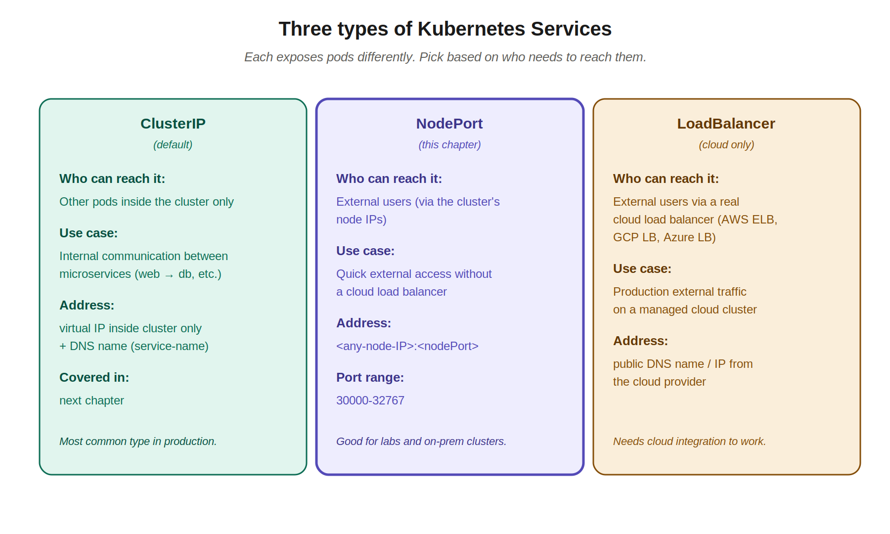
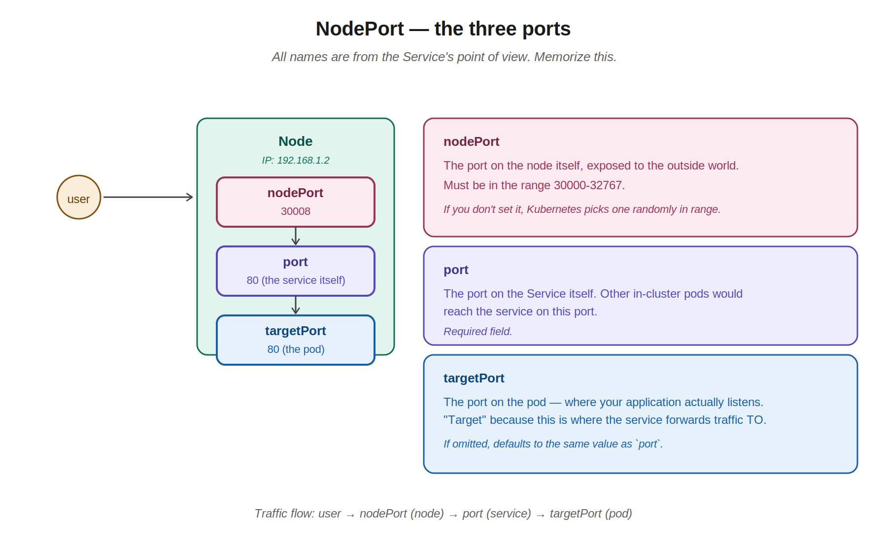
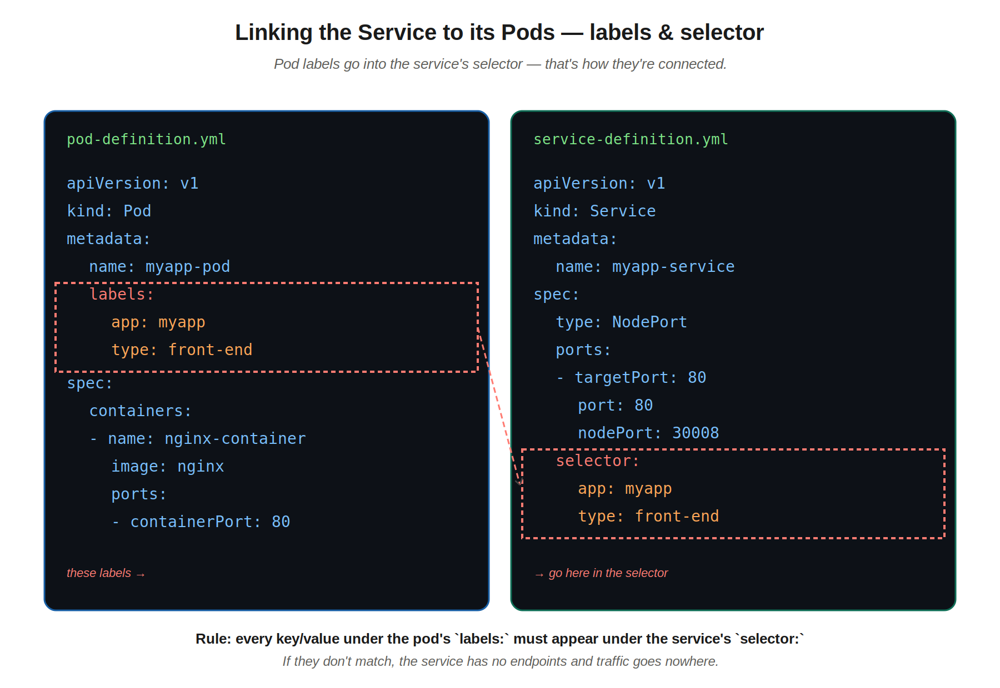
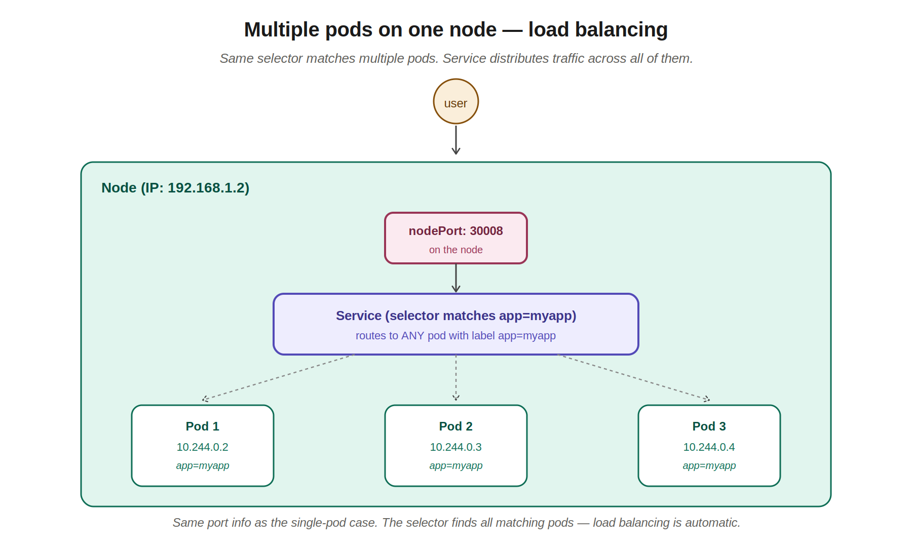
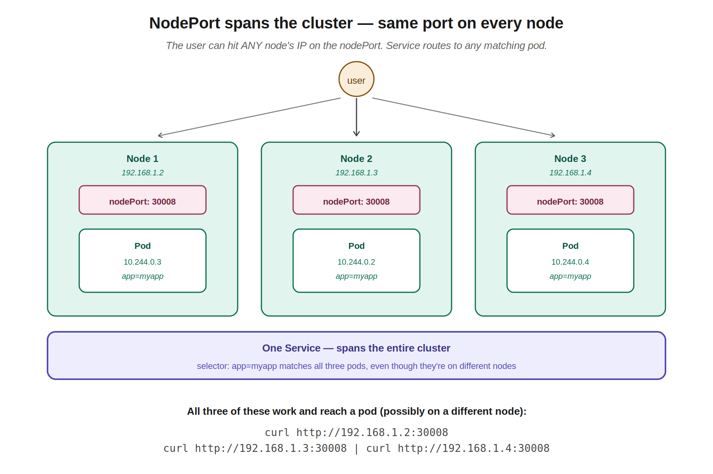

# 08 — Services (NodePort)

> Services are the network glue of Kubernetes. They give pods stable addresses so users and other applications can reach them — even when pods come and go. This chapter covers the *why* of Services and focuses on **NodePort**, the type you use to expose pods to the outside world. ClusterIP and LoadBalancer get their own chapter.

---

## 1. Why we need Services

Pods are ephemeral. They get random IPs that change every time a pod is recreated. If your web app has 4 pods and you tell users to remember the IPs, those IPs are wrong by tomorrow.

Also: there's no good way for an outside user to even *reach* a pod directly. Pod IPs are internal to the cluster's pod network — they aren't routable from outside.

You could SSH into a node and use `curl` from there to hit the pod's internal IP. But that's:
- Not practical for real users
- Not stable (pod IPs change)
- Not scalable (no load balancing across replicas)

**Services solve all three.** A Service gives you a single, stable address that load-balances across whatever pods match its selector — and depending on the Service type, it can be reachable from inside the cluster, from outside, or via a cloud load balancer.

Services also **enable loose coupling**. Your web app doesn't need to know the IP addresses of the database pods. It just talks to the `database` service, and the service routes to whichever pods are healthy and ready.

---

## 2. The three Service types



| Type | Reachable from | Use case |
|---|---|---|
| **ClusterIP** (default) | Inside the cluster only | Pod-to-pod communication (web → db, microservice A → B) |
| **NodePort** | Outside, via any node's IP on a specific port | Quick external access, on-prem clusters, labs |
| **LoadBalancer** | Outside, via a cloud LB | Production external traffic on AWS/GCP/Azure clusters |

The instructor mentioned all three; this chapter is **NodePort**. The next chapter covers ClusterIP in depth. LoadBalancer is essentially "NodePort + an automatic cloud load balancer in front" — same concepts, different external entry point.

---

## 3. The three ports in NodePort

This is the part that confused you, and confuses almost everyone. The naming convention is "from the Service's perspective" — once you internalize that, the names make sense.



| Port name | What it refers to | Required? |
|---|---|---|
| **targetPort** | The port on the **pod** — where your app actually listens | No (defaults to `port`) |
| **port** | The port on the **service** itself | Yes |
| **nodePort** | The port on the **node** — exposed to outside the cluster | No (random in 30000-32767 if omitted) |

### The traffic flow

User → `nodePort` on the node → `port` on the service → `targetPort` on the pod

Reading that left-to-right is the journey of one request. The user hits a node's IP on the nodePort, the node forwards into the cluster service network on `port`, and the service forwards to a matching pod on `targetPort`.

### Why "target" port

It's the **target** of the service's forwarding — i.e., where the service sends traffic *to*. The other two ports describe entry points; targetPort describes the destination.

### The nodePort range

NodePort ports must be in **30000-32767**. This is a Kubernetes-imposed range to keep them separate from common application ports (80, 443, 22, etc.) and to make NodePorts predictable for firewall rules.

If you specify a nodePort outside this range, Kubernetes rejects the manifest.

---

## 4. Service definition YAML

The structure mirrors what you've seen for Pods, ReplicaSets, and Deployments. The `spec` is where the action is.

```yaml
apiVersion: v1
kind: Service
metadata:
  name: myapp-service
spec:
  type: NodePort
  ports:
    - targetPort: 80
      port: 80
      nodePort: 30008
  selector:
    app: myapp
    type: front-end
```

Breaking it down:

- **`type: NodePort`** — the Service type (the section above)
- **`ports`** is a list (so you can expose multiple ports per service, though usually just one)
  - **`targetPort: 80`** — your app listens on port 80 inside the pod
  - **`port: 80`** — the Service exposes port 80 itself (could be anything; using same as targetPort is a common choice)
  - **`nodePort: 30008`** — outside users reach the cluster on this port on any node
- **`selector`** — which pods this Service routes traffic to (more on this in section 5)

Apply it:
```bash
kubectl create -f service-definition.yml
# service/myapp-service created
```

Check:
```bash
kubectl get services
# NAME            TYPE        CLUSTER-IP       EXTERNAL-IP   PORT(S)        AGE
# kubernetes      ClusterIP   10.96.0.1        <none>        443/TCP        16d
# myapp-service   NodePort    10.106.127.123   <none>        80:30008/TCP   5m
```

Notice the `PORT(S)` column shows `80:30008/TCP` — that's `port:nodePort`. You can now curl:

```bash
curl http://192.168.1.2:30008
# <html>... your nginx welcome page ...</html>
```

### Optional vs required

- `port` is **required** — you must specify it
- `targetPort` is **optional** — if omitted, defaults to the value of `port`
- `nodePort` is **optional** — if omitted, Kubernetes assigns a random one in 30000-32767

So the minimal NodePort service definition could be:

```yaml
spec:
  type: NodePort
  ports:
    - port: 80
  selector:
    app: myapp
```

That works — targetPort defaults to 80, nodePort gets assigned randomly. The verbose version with all three ports is what you write when you want explicit control.

---

## 5. How a Service finds its pods — labels & selectors

The Service doesn't list pod names directly. It uses **labels** as a filter — the same mechanism as ReplicaSets and Deployments.

The rule: **every key/value under the pod's `labels:` must appear under the service's `selector:`**.



### Step-by-step workflow

This is what the instructor described as "copy the labels into the service definition."

**Step 1: Pod has labels**
```yaml
# pod-definition.yml
metadata:
  name: myapp-pod
  labels:
    app: myapp           # ← these labels...
    type: front-end
```

**Step 2: Service selector copies them**
```yaml
# service-definition.yml
spec:
  selector:
    app: myapp           # ← ...go here as the selector
    type: front-end
```

**Step 3: Apply both**
```bash
kubectl apply -f pod-definition.yml
kubectl apply -f service-definition.yml
```

The Service starts routing traffic to any pod whose labels match.

### Common mistake — selector doesn't match labels

If the pod has labels `app: myapp` but the service selector is `app: web-app`, **the service finds no pods**. The service still exists, but it has no endpoints. Curling it returns connection errors. You can check this:

```bash
kubectl get endpoints myapp-service
# NAME            ENDPOINTS   AGE
# myapp-service   <none>      5m
```

`<none>` for endpoints means the selector matched nothing. Fix the labels or selector and the endpoints will populate.

---

## 6. The JPMC customer-account-alias-service

The Service definition at your work follows this exact pattern. It looks something like this (names changed):

```yaml
apiVersion: v1
kind: Service
metadata:
  name: customer-account-alias-service
  labels:
    app: customer-account-alias-service
    appIdentity: caas
spec:
  type: ClusterIP                    # internal only (probably — that's typical at JPMC)
  ports:
    - port: 8080
      targetPort: 8080
      protocol: TCP
  selector:
    app: customer-account-alias-service
```

A few things to note about real production Service manifests:

- **Type is ClusterIP**, not NodePort. JPMC's CaaS environment uses internal services and routes external traffic through ingress controllers and corporate load balancers — NodePorts aren't appropriate for production banking infrastructure.
- **The selector matches one of the labels on the pod template** — specifically `app: customer-account-alias-service`. The pod has other labels too (`appIdentity: caas`, `enableIdentityHelper: "true"`, etc.) but the selector only needs to match the ones it cares about.
- **Single port** — most apps expose just one port. Multi-port services exist (e.g., for an app that serves HTTP and HTTPS) but are less common.

The chain to remember:

1. Your team's **Deployment** manifest has a pod template with `labels: { app: customer-account-alias-service }`
2. The Deployment creates **ReplicaSets** which create **Pods** with those labels
3. The **Service** manifest has `selector: { app: customer-account-alias-service }`
4. Other pods in the namespace (or external traffic, depending on type) reach the pods through the Service

This is the network half of what makes the JPMC pod from chapter 4 actually serve traffic.

---

## 7. Multiple pods — load balancing automatically

The instructor's example mapped a Service to one pod. In production you always have multiple pods for reliability. The good news: **you don't change anything in the Service definition.**



What happens:

- The Service's selector matches every pod with the right labels (3 pods, 10 pods, whatever).
- Each matching pod becomes an "endpoint" of the Service.
- Incoming requests are distributed across the endpoints — by default using a **random algorithm with session affinity** (so the same client tends to land on the same pod within a session, but different clients spread across pods).

The port info doesn't change either. All three ports stay the same — only the number of matching pods grows.

### Checking endpoints

```bash
kubectl get endpoints myapp-service
# NAME            ENDPOINTS                                AGE
# myapp-service   10.244.0.2:80,10.244.0.3:80,10.244.0.4:80   5m
```

Three endpoints — the Service is load-balancing across three pods.

---

## 8. Multiple nodes — the Service spans the cluster

This is the part you got excited about, and rightly so. It's one of the elegant things about Kubernetes networking.



### What happens

When you create a NodePort Service in a cluster with multiple nodes:

1. **Kubernetes opens the same nodePort (e.g., 30008) on EVERY node in the cluster.** Even nodes that don't run a matching pod will accept traffic on that port.
2. **When traffic hits any node on that port, kube-proxy on that node routes it to a matching pod** — which might be on the same node, or on a different one entirely.
3. **The Service object itself is cluster-wide** — there's exactly one Service, not one per node.

### Why this matters

Three different users can hit three different node IPs and all get served:

```bash
curl http://192.168.1.2:30008      # hits Node 1, routed to some pod
curl http://192.168.1.3:30008      # hits Node 2, routed to some pod
curl http://192.168.1.4:30008      # hits Node 3, routed to some pod
```

They all reach an instance of the application. Some requests might be served by a pod on the same node they hit; others bounce across the internal cluster network to a pod on a different node. **The user doesn't know or care.**

This is what made the instructor's slide so striking — that orange "Service" bar visually spans across all the nodes. The service is a logical entity, not a thing that lives on one specific node.

### How does kube-proxy do this?

Quick mention because you're curious about internals. **kube-proxy** runs on every node (you saw it in chapter 1's worker node components). When the Service is created, the controllers tell each kube-proxy to install routing rules. These rules use **iptables** (or **IPVS**, depending on cluster config) to:

- Listen for traffic on the nodePort
- Match against the service's ClusterIP and port
- Pick one of the endpoints (the matching pods)
- Rewrite the destination address and forward the packet

When pods are created, deleted, or updated, the endpoints change. kube-proxy updates its rules automatically. This is why "when pods are updated or deleted the services are automatically updated" — there's nothing magic; it's just kube-proxy reacting to API events. This is also a great example of what's worth digging into if you want to learn Kubernetes internals (and a great reason to learn Go down the line).

---

## 9. Generating service YAML quickly

There's no direct `kubectl create service` for arbitrary use, but **`kubectl expose`** generates a Service from an existing pod or deployment. Very useful for the exam.

```bash
# Expose a pod as a NodePort service
kubectl expose pod myapp-pod --type=NodePort --port=80 --target-port=80 --name=myapp-service

# Generate the YAML without creating
kubectl expose pod myapp-pod --type=NodePort --port=80 --target-port=80 --name=myapp-service $do > svc.yaml
```

A gotcha: `kubectl expose` does NOT support setting a specific `nodePort`. You'd need to generate the YAML, edit it to add the nodePort, then apply.

```bash
# Generate, edit to add nodePort, apply
k expose pod myapp-pod --type=NodePort --port=80 --name=myapp-service $do > svc.yaml
vim svc.yaml             # add nodePort: 30008 under ports
k apply -f svc.yaml
```

Alternative for fully imperative service creation:

```bash
# Create a service directly (limited options)
kubectl create service nodeport myapp-service --tcp=80:80 --node-port=30008
```

The `--tcp=80:80` is `port:targetPort`. Limited but works for simple cases.

---

## 10. Inspecting a Service

```bash
# List services
kubectl get services
kubectl get svc                              # short form

# Detailed info
kubectl describe service myapp-service

# See which pods the service is routing to
kubectl get endpoints myapp-service

# See it in the bigger picture
kubectl get all                              # includes services
```

The `kubectl describe` output is especially useful:
- `Selector` — what labels the service is matching on
- `Endpoints` — the pod IPs that match. If empty, your selector doesn't match any pods.
- `Type` — ClusterIP, NodePort, or LoadBalancer
- `Port`, `NodePort`, `TargetPort` — all three values shown clearly

---

## 11. kubectl commands cheat sheet — Services

```bash
# Create
kubectl create -f service.yaml
kubectl create service nodeport <name> --tcp=<port>:<targetport> --node-port=<nodeport>
kubectl expose pod <pod-name> --type=NodePort --port=<port> --name=<svc-name>
kubectl expose deployment <deploy-name> --type=NodePort --port=<port> --name=<svc-name>
k expose pod <name> --type=NodePort --port=80 $do > svc.yaml      # generate YAML

# Inspect
kubectl get services                 # or 'svc'
kubectl get svc -o wide
kubectl describe service <name>
kubectl get endpoints <name>         # see which pods it's routing to

# Test from inside the cluster (creates a temporary pod)
kubectl run test --image=busybox --rm -it --restart=Never -- wget -O- <service-name>:80

# Delete
kubectl delete service <name>
```

---

## Quick recall checklist

- [ ] What problem does a Service solve that direct pod IPs don't?
- [ ] What are the three Service types and when do you use each?
- [ ] In a NodePort service, what are the three port fields and what does each represent?
- [ ] What range must `nodePort` be in?
- [ ] What happens if you omit `targetPort`? What about `nodePort`?
- [ ] How does a Service know which pods to route to?
- [ ] What's the rule about pod labels and service selectors?
- [ ] What does `kubectl get endpoints <service>` show you?
- [ ] In a multi-node cluster, on how many nodes is the nodePort open?
- [ ] What component on each node actually routes the traffic to pods?

---

## Notes for next chapters

Up next: **ClusterIP Services** — the default type, used for internal pod-to-pod communication. Same selector mechanism, different addressing (cluster-internal virtual IP plus DNS name like the `db-service.dev.svc.cluster.local` format from chapter 7). After that, LoadBalancer (which is just NodePort + a cloud LB in front).
