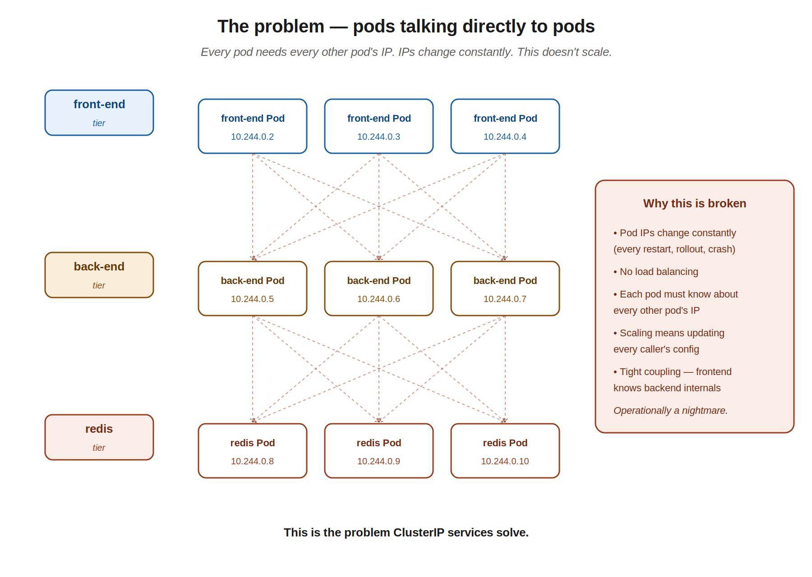
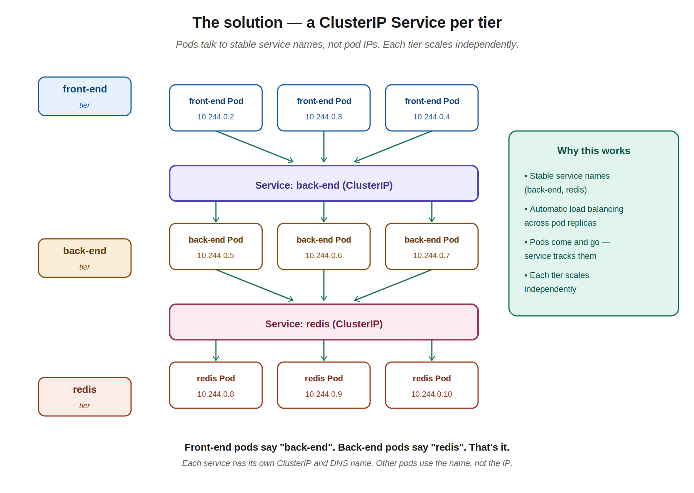
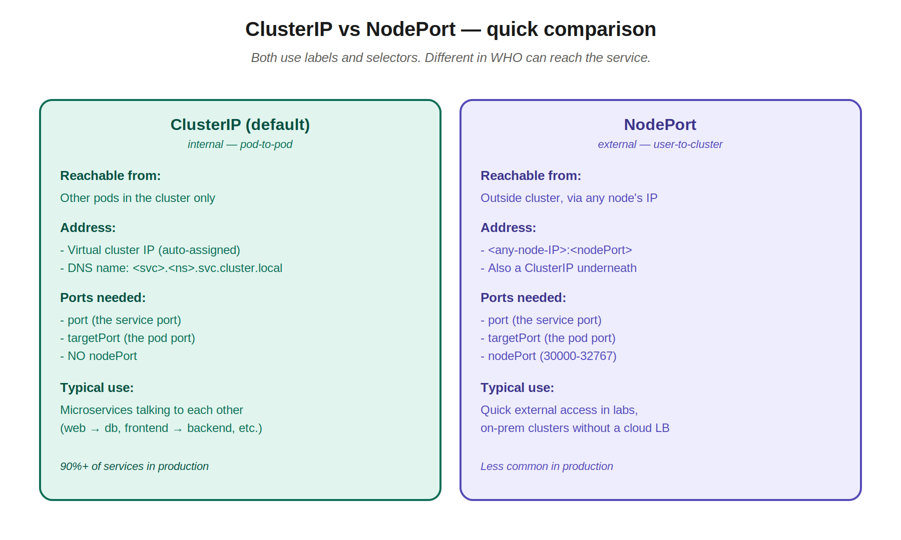

# 09 — Services (ClusterIP)

> ClusterIP is the default Service type, and the one you'll actually use most in production. Where NodePort exposed pods to the outside world, ClusterIP is for **pods talking to other pods**. This is the network glue that makes microservice architectures actually work.

---

## 1. The problem — the chaos of pod-to-pod direct connections

The instructor sets this up with a classic three-tier app: front-end pods talk to back-end pods, back-end pods talk to a redis key-value store. What's the right way to connect these tiers?

The naive approach — frontend pods hardcoding backend pod IPs — falls apart immediately:



What goes wrong:

- **Pod IPs are dynamic.** They change every time a pod restarts, gets rescheduled, or scales up/down. Hardcoded IPs become wrong almost immediately.
- **No load balancing.** A single frontend pod hardcoded to one backend pod's IP can't distribute requests across the other backends.
- **Tight coupling.** Every frontend pod needs to know every backend pod's IP. Scaling means updating configs everywhere.
- **No fault tolerance.** A pod dies, every caller pointed at it breaks.

This is the real-world pain you experienced at Visa with IP whitelisting. Teams asking "what IP will you be connecting from?" and you having to negotiate a range because you couldn't give them a single stable IP. ClusterIP solves the *internal* version of that problem — pods inside the cluster get a stable name to reach a tier, regardless of which specific pod actually handles the request.

---

## 2. The solution — one Service per tier

A **ClusterIP Service** sits in front of each tier. It groups the pods of that tier together and gives them a single stable identity that other pods can use.



What changes:

- Frontend pods say "connect to `back-end`" — they don't know or care which backend pod actually handles the request.
- Backend pods say "connect to `redis`" — same story.
- Each Service has a stable virtual IP **and** a DNS name (more on this in section 5).
- Each tier can scale independently. Add 5 more backend pods? The `back-end` service finds them automatically through label selectors. Frontend pods don't need to change.

This is what "microservices architecture" looks like in practice on Kubernetes. **Loose coupling** — each service is a black box to its callers. They know the service name; they don't know the implementation details.

---

## 3. ClusterIP YAML

Same structure as the NodePort definition from chapter 8, with two key differences:

```yaml
apiVersion: v1
kind: Service
metadata:
  name: back-end
spec:
  type: ClusterIP                # ← the type (or omit — ClusterIP is the default)
  ports:
    - targetPort: 80             # the pod port
      port: 80                   # the service port
                                 # ← no nodePort here
  selector:
    app: myapp
    type: back-end
```

Differences from NodePort:

1. **`type: ClusterIP`** (or just omit `type:` entirely — ClusterIP is the default if not specified)
2. **No `nodePort`** — there's no external exposure, so no nodePort field

Everything else is identical to NodePort:
- Same `port` and `targetPort` semantics
- Same `selector` mechanism to find pods by label
- Same `kubectl create -f` workflow

Apply and check:

```bash
kubectl create -f service-definition.yml
# service/back-end created

kubectl get services
# NAME         TYPE        CLUSTER-IP       EXTERNAL-IP   PORT(S)   AGE
# kubernetes   ClusterIP   10.96.0.1        <none>        443/TCP   16d
# back-end     ClusterIP   10.106.127.123   <none>        80/TCP    2m
```

Notice the `PORT(S)` column shows `80/TCP` (no `:nodePort` part) and `EXTERNAL-IP` is `<none>` — this service is internal only. The `CLUSTER-IP` (10.106.127.123 in the example) is what other pods would use to reach it.

---

## 4. The selector pattern (same as NodePort)

Just to recap the rule from chapter 8, which applies identically to ClusterIP:

**The Service's selector labels must match the pod's labels.** Every key/value pair under the service's `selector:` must appear under the pod's `metadata.labels:`.

```yaml
# pod-definition.yml
metadata:
  name: myapp-pod
  labels:
    app: myapp           # ←
    type: back-end       # ←
```

```yaml
# service-definition.yml
spec:
  selector:
    app: myapp           # ← these match
    type: back-end       # ← these match
```

If they don't match, `kubectl get endpoints <service>` shows `<none>` and traffic to the service goes nowhere. Same debugging pattern as before.

---

## 5. How pods actually reach a ClusterIP service — DNS

This is where chapter 7's namespace material pays off. When you create a Service named `back-end`, Kubernetes automatically:

1. **Assigns a ClusterIP** — a virtual IP in the cluster's internal IP range. Other pods can reach the service on this IP.
2. **Creates a DNS entry** — so pods can use the service name instead of the IP.

So inside the cluster, a frontend pod connecting to the backend can use:

```python
# Inside the same namespace — short name works
db.connect("back-end:80")

# Across namespaces — fully-qualified DNS name
db.connect("back-end.production.svc.cluster.local:80")
```

Reminder of the FQDN format from chapter 7:
```
<service-name>.<namespace>.svc.cluster.local
```

This is why ClusterIP services are so powerful for microservices: your app code references `back-end` (or `redis`, or `users-service`) — a stable, human-readable name — and Kubernetes' DNS handles the resolution. Pods can come and go; the name stays the same.

---

## 6. The JPMC customer-account-alias-service revisited

Now you can read your JPMC Service manifest with full understanding. It almost certainly looks something like this (names changed):

```yaml
apiVersion: v1
kind: Service
metadata:
  name: customer-account-alias-service
  namespace: 700515d201053-caas-dev
spec:
  type: ClusterIP
  ports:
    - port: 8080
      targetPort: 8080
      protocol: TCP
  selector:
    app: customer-account-alias-service
```

What's happening:

- **type: ClusterIP** — internal only. External traffic to JPMC banking services doesn't come through NodePort; it goes through corporate load balancers, ingress controllers, and API gateways before reaching the cluster.
- **port 8080** — the service exposes port 8080. Internal callers use this.
- **targetPort 8080** — matches the pod's container port (from the JPMC pod YAML in chapter 4: `containerPort: 8080`).
- **selector** — matches the pod's `app: customer-account-alias-service` label.

When another microservice in JPMC's CaaS environment needs to talk to your team's service, it uses:

```
customer-account-alias-service.700515d201053-caas-dev.svc.cluster.local:8080
```

Or, if it's in the same namespace, just:

```
customer-account-alias-service:8080
```

Same pattern. Same mechanism. Just at production scale with a more elaborate namespace name.

---

## 7. ClusterIP vs NodePort — recap



| | ClusterIP | NodePort |
|---|---|---|
| Reachable from | Inside cluster only | Outside cluster, via any node IP |
| Address | Virtual cluster IP + DNS name | Node IP : nodePort |
| Ports defined | `port`, `targetPort` | `port`, `targetPort`, `nodePort` |
| Default? | Yes (if `type:` omitted) | No (must specify) |
| Use case | Microservice-to-microservice | External access (labs, on-prem) |
| Production prevalence | 90%+ of services | Less common |

Important to understand: **a NodePort service is also a ClusterIP service**. NodePort is built on top of ClusterIP — it gets a cluster IP AND exposes a port on every node. You can see this in the kubectl output for a NodePort service:

```
NAME            TYPE        CLUSTER-IP       EXTERNAL-IP   PORT(S)        AGE
myapp-service   NodePort    10.106.127.123   <none>        80:30008/TCP   5m
```

That `CLUSTER-IP: 10.106.127.123` exists even though the type is NodePort. So a NodePort service can be reached three ways:
- Externally via `<node-ip>:30008`
- Internally via the ClusterIP `10.106.127.123:80`
- Internally via DNS `myapp-service:80`

ClusterIP gives you only the latter two — no external entry point.

---

## 8. Generating a ClusterIP service quickly

Same `kubectl expose` pattern from chapter 8, but you can omit `--type` (or specify `--type=ClusterIP`):

```bash
# Expose a pod or deployment as a ClusterIP service
kubectl expose pod myapp-pod --port=80 --target-port=80 --name=back-end

kubectl expose deployment back-end-deploy --port=80 --target-port=8080 --name=back-end

# Generate the YAML to edit before applying
k expose deployment back-end-deploy --port=80 --target-port=8080 --name=back-end $do > svc.yaml
```

If you want to be explicit (and you should, on the exam):

```bash
kubectl expose pod myapp-pod --type=ClusterIP --port=80 --target-port=80 --name=back-end
```

Fully imperative service creation (also limited but useful):

```bash
kubectl create service clusterip back-end --tcp=80:80
```

The `--tcp=80:80` is `port:targetPort`.

---

## 9. Testing a ClusterIP service

Since you can't curl a ClusterIP from outside the cluster, the standard trick is to spin up a temporary pod inside the cluster and test from there:

```bash
# Run a temporary busybox pod, exec into it, test, exit (pod cleans itself up)
kubectl run test --image=busybox --rm -it --restart=Never -- wget -O- back-end:80
```

Or test from an existing pod:

```bash
kubectl exec -it <existing-pod> -- curl back-end:80
```

For the exam, the temporary `kubectl run` trick is faster — it works in one line with no setup.

---

## 10. kubectl commands cheat sheet — ClusterIP

```bash
# Create
kubectl create -f service.yaml
kubectl create service clusterip <name> --tcp=<port>:<targetport>
kubectl expose pod <pod-name> --port=<port> --target-port=<targetport> --name=<svc-name>
kubectl expose deployment <deploy-name> --port=<port> --target-port=<targetport> --name=<svc-name>
k expose deployment <name> --port=80 $do > svc.yaml      # generate YAML

# Inspect
kubectl get services                         # or 'svc'
kubectl get svc <name>
kubectl describe service <name>
kubectl get endpoints <name>                 # see which pods it routes to

# Test from inside cluster
kubectl run test --image=busybox --rm -it --restart=Never -- wget -O- <service-name>:<port>

# Delete
kubectl delete service <name>
```

---

## Quick recall checklist

- [ ] What problem does ClusterIP solve that NodePort doesn't?
- [ ] What's the default Service type if you don't specify `type:`?
- [ ] What two things does Kubernetes automatically create when you make a ClusterIP service (besides the service object itself)?
- [ ] What's the FQDN format a pod in namespace A would use to reach a service in namespace B?
- [ ] Why doesn't a ClusterIP service have a `nodePort` field?
- [ ] What's the difference between `port` and `targetPort`?
- [ ] If `kubectl get endpoints my-service` shows `<none>`, what's wrong and how do you fix it?
- [ ] How would you test a ClusterIP service from your terminal (without exposing it externally)?
- [ ] What two ways could a pod reach a ClusterIP service — by what?
- [ ] Is a NodePort service ALSO a ClusterIP service?

---

## Notes for next chapters

Up next: **LoadBalancer Service type** (the third type), or in some course orderings, **Ingress** (a layer-7 HTTP router that sits in front of services and is what production apps actually use for external traffic). After Services, the curriculum typically moves into application lifecycle concerns — configmaps, secrets, multi-container patterns, observability — the day-to-day stuff that fills the CKAD exam.
